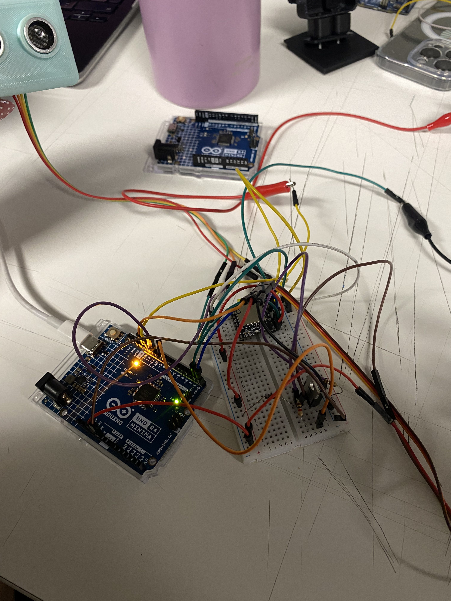
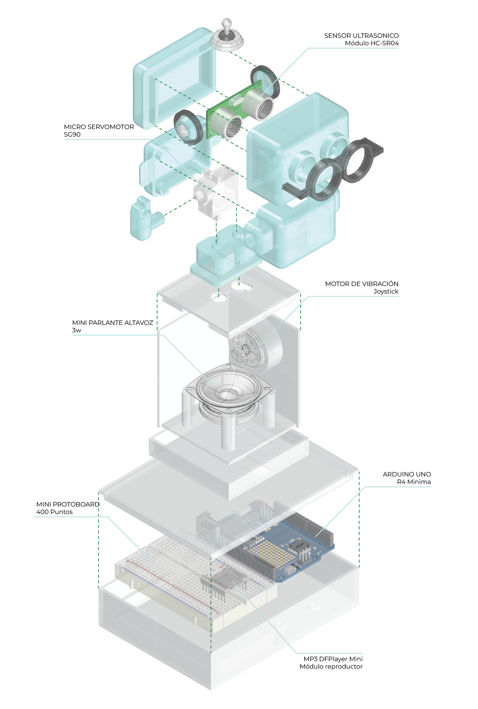
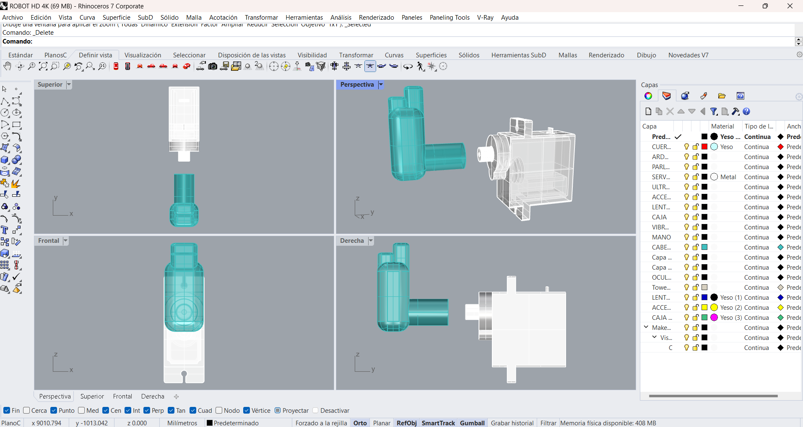
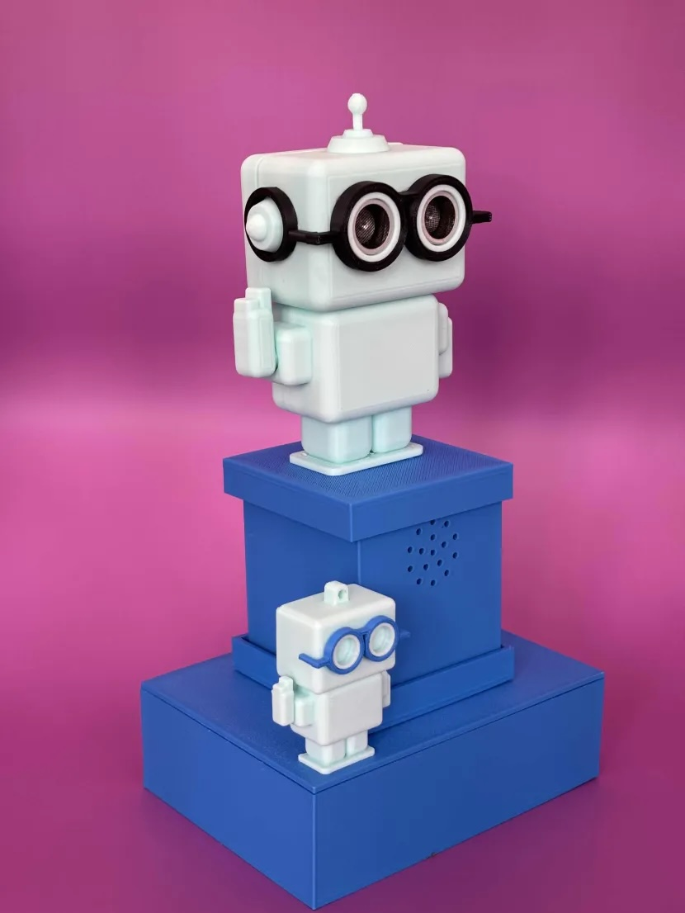
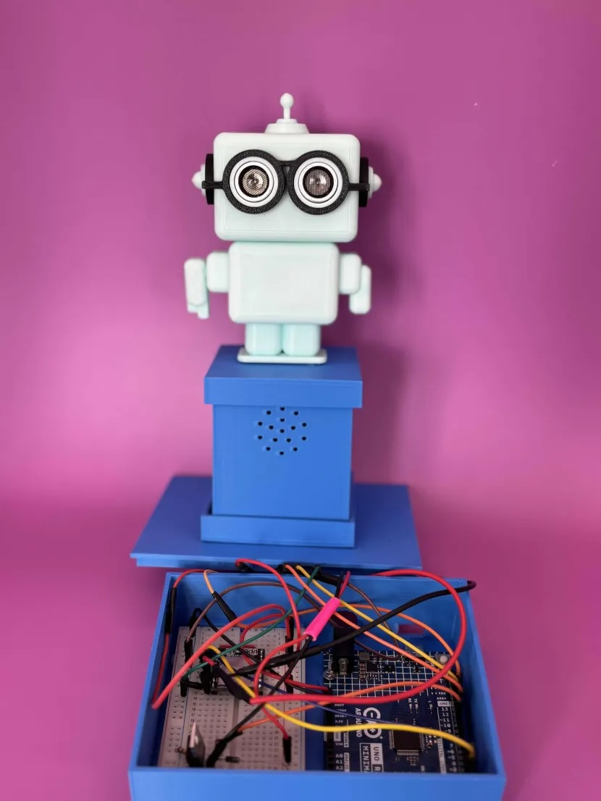
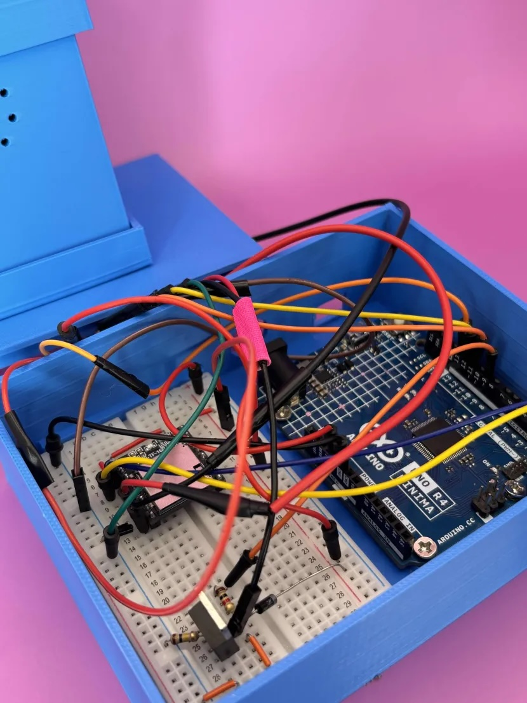
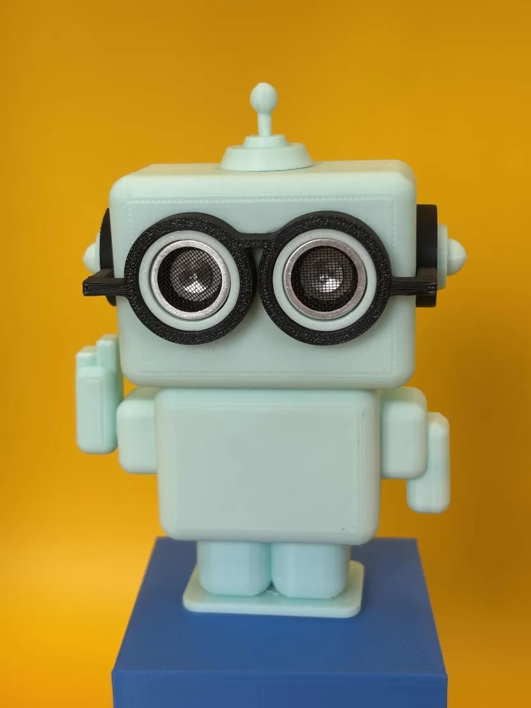
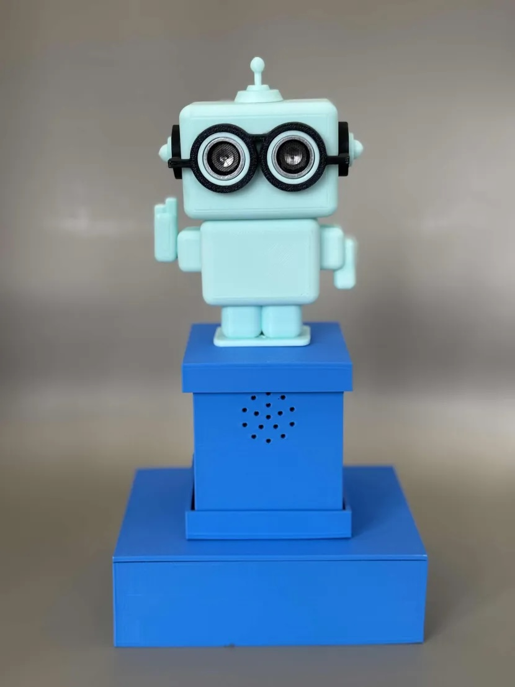

# Proyecto-02

## Acerca del proyecto

- Grupo: 01
- Nombre de grupo: leonas.ino
- Integrantes:
  - Yamna Carrión / [yamna-bit](https://github.com/yamna-bit)
  - Sofía Cartes / [sofiacartes](https://github.com/sofiacartes)
  - Millaray Millar / [mmillar95](https://github.com/mmillar95)
  - Vania Paredes /  [21vaniaparedes](https://github.com/21vaniaparedes)
  - Valentina Ruz /[vxlentinaa](https://github.com/vxlentiinaa)

## Presentación textual

### AND-Y

El proyecto consiste en un robot que saluda mediante la interacción con algún humano, por medio de el sensor de ultrasónico programado con Arduino R4 Minima. A través, de las diferentes distancias puede recorrer tres fases de audios:

`DIÁLOGOS:`

`Audios de saludo: Fase 1 y 2`

- Decir "hola humano, ¿porqué estas tan lejos?. Acércate"
- "Hola, no seas tímido, ven más cerca. no tengo, virus creoo, jiji. "

`Datos curiosos que dirá: Fase 3`

- “¿Sabías qué?, los 99% de los problemas se arreglan reiniciando.”
- “La nube no existe, son computadores de otro.”
- “Los datos nunca se borran, sólo se esconden.”
- “El error 404 es mi manera de hacerme el leso.”
- “El primer mouse era de madera.”
  
## Inputs y outputs

Componentes a utilizar:

| Componentes | Cantidad | Unidad          | OBS |
|---------|----------------------------------|------------------|------------------|
| Mini Protoboard | 1 | 400 puntos | Conexión VCC GND directa al arduino |
| Arduino UNO | 1 | R4 Minima | Conexión directa a corriente |
| Sensor Ultrasónico |  1 | HC-SR04 | PIN TRIGGER al PIN 11 - PIN ECHO al PIN 12 - VCC a 5V y GND a GND |
| ServoMotor | 1 | SG90 | VCC a 5V - GND a GND y PIN 13 |
| Motor Vibrador | 1  | Joystick | VCC a 5V Esquemático de conexión más abajo |
| Transistor | 1 | FET IRFZ44n | Mosfet-m Esquemático de conexión más abajo |
| Resistencia | 1 | 1K | Esquemático de conexión más abajo |
| Resistencia | 1 | 100K | Esquemático de conexión más abajo |
| Diodo | 1 | IN4007 | Esquemático de conexión más abajo |
| Reproductor MP3 | 1 | DFPlayer mini | VCC a 5V - Negativo altavoz a STK_2 - Positivo altavoz a STK_1 - TX al RX Arduino - RX al TX Arduino - GND a GND |
| Tarjeta SD | 1 | 255gb | Reproductor MP3 |
| Altavoz | 1 | Mini Parlante 3W | Negativo a STK_2 Reproductor - Positivo a STK_1 Reproductor |
  
### Input

Mediante el sensor ultrasónico, la máquina detecta movimiento/presencia y mide la distancia.

### Output

Al detectar la distancia de la presencia la máquina reacciona de diferentes formas, según los siguientes componentes:

- Altavoz
- Servomotor al levantar el brazo
- Motor vibrador al detectar presencia de algún humano

### Esquemático de conexión Motor Vibración Joystick

Esquemático hecho por misa en clase.


- Esquema mosfet-m:


`REACCIONES`

1. Cuando detecte una presencia esta comenzará a temblar (de nervios) mediante el motor vibración Joystick la accíon de temblar aumentará entre más cerca estés.
2. El sensor detectará presencia en 3 instancias: 2 - 20 cm, 70 - 90cm, 130 - 150cm.
En cada parámetro la máquina reproduce un audio de voz distinto mediante la microSD en el reproductor MP3 y el altavoz.
3. Los parámetros son:

- 130 - 150cm = Te "grita" que vengas. diciendo: "Hola humano, ¿Por qué estás tan lejos?. Acércate.
- 80 - 100cm = Te grita de nuevo pidiendo que te acerques más, diciendo: "Hola, no seas tímido, ven más cerca, no tengo virus creoo, jiji."
- 02 - 20cm = Levanta un "dedo" usando el servo motor, este se moverá de los 0 grados a los 180 mientras estés a esa distancia. Al mismo tiempo te dirá los siguientes datos curiosos:

- “¿Sabías qué?, los 99% de los problemas se arreglan reiniciando.”
- “La nube no existe, son computadores de otro.”
- “Los datos nunca se borran, sólo se esconden.”
- “El error 404 es mi manera de hacerme el leso.”
- “El primer mouse era de madera.”

### Bocetos de planificación


### Más procesos de códigos y fotografías en Github

`DIFICULTADES Y DESAFÍOS`

Tuvimos muchas dificultades, pero solucionables.

- Una de las primeras dificultades fue definir bien el proyecto, ya que la primera idea podría pasar el dialecto de una cultura. Recordemos que se basaba en un selector de idiomas con joystick y que cada vez que uno seleccione un idioma, el robot haga un gesto. También, redactabamos ideas, pero no nos convencían y se parecían mucho a las demás.
- Otro problema fue que no sabíamos como comenzar, estabamos un poco perdidas; pero buscamos referentes de código que sirvieron para guiarnos y así comenzar con nuestro código.
- Una de las mayores dificultades fue el sensor ultrasónico, ya que cuando implementabamos el código, la distancia no era exacta ni tampoco la redondeaba. Por otra parte, nos complicó el reproductor MP3, primero por la tarjeta SD, ya que no era solo llegar y colocarla, había que formatearla y ver que los audios estén subidos en el orden correcto y formato correcto; probamos unos códigos pero no funcionaba y Mateo con Janis encontraron un repositorio con un código predeterminado y ahí recién funcionó.
- Al tener estas dos funciones listas, se nos complicó la parte de reproducir los audios, ya que los decía en loop todo el rato y no se quedaba estático, no tenía tiempo de reposo.
- Otro problema, fue juntar todos los códigos que teníamos, ya que cuando el ultrasónico medía la distancia, el audio se reproducía como lorito y el motor de vibración no vibraba. Y el servomotor tampoco se levantaba. Nos dimos cuenta que todo funcionaba bien por separado pero hubo problemas al juntarlos.





## Etapas del código

`ETAPAS DE PROCESO DE CÓDIGO ARRIBA EN FILES CON FECHA DE MODIFICACIONES.`

### 1. Entrada Sensor Ultrasónico

El código comienza midiendo la distancia con el Sensor Ultrasónico

ARCHIVO.cpp

```cpp
#include "EntradaUltrasonico.h"

EntradaUltrasonico::EntradaUltrasonico() {}

EntradaUltrasonico::~EntradaUltrasonico() {}

void EntradaUltrasonico::configurar() {
  pinMode(patitaTrigger, OUTPUT);
  pinMode(patitaEcho, INPUT);
  Serial.begin(9600);
}

float EntradaUltrasonico::medirDistancia() {
 // mide distancia enviando un pulso de sonido
 // y mide cuanto tardar en regresar
  digitalWrite(patitaTrigger, LOW);
  delayMicroseconds(2);
  digitalWrite(patitaTrigger, HIGH);
  delayMicroseconds(10);
  digitalWrite(patitaTrigger, LOW);

  // lee el eco recibido
  duracion = pulseIn(patitaEcho, HIGH);

  // convierte la distancia a cm (velocidad del sonido = 343 m/s)
  distanciaCm = int(float(duracion) * 0.0343 / 2.0);

  return distanciaCm;
}

void EntradaUltrasonico::decidirCercania() {
  int nuevoEstado = -1;

  // determinar en que zona esta la distancia
  if (distanciaCm >= minCercana && distanciaCm <= maxCercana) {
    nuevoEstado = 0; // cercana
  } 
  else if (distanciaCm >= minMediana && distanciaCm <= maxMediana) {
    nuevoEstado = 1; // mediana
  } 
  else if (distanciaCm >= minLejana && distanciaCm <= maxLejana) {
    nuevoEstado = 2; // lejana
  }

  // cambia solo si ha pasado tiempo suficiente desde el ultimo cambio
  if (nuevoEstado != ultimoEstado && (millis() - ultimoCambio > tiempoEstabilidad)) {
    ultimoCambio = millis();
    ultimoEstado = nuevoEstado;
    dondeEsta = nuevoEstado;
  } 
  else {
    dondeEsta = ultimoEstado;
  }
}
```

ARCHIVO.h

```cpp
#ifndef ENTRADAULTRASONICO_H
#define ENTRADAULTRASONICO_H

#include <Arduino.h>

class EntradaUltrasonico {
public:
  EntradaUltrasonico();
  ~EntradaUltrasonico();

  void configurar();
  float medirDistancia();
  void decidirCercania();

  // valores actuales
  int dondeEsta;     // 0 = cercana, 1 = mediana, 2 = lejana, -1 = nada
  float distanciaCm; // distancia medida

  // pines del sensor
  const int patitaTrigger = 11;
  const int patitaEcho = 12;

  // rangos de distancia (puedes ajustarlos)
  const int minCercana = 0;
  const int maxCercana = 20;
  const int minMediana = 50;
  const int maxMediana = 90;
  const int minLejana = 120;
  const int maxLejana = 180;

  long duracion;

  // variables para evitar repeticiones de loro
  int ultimoEstado = -1;
  unsigned long ultimoCambio = 0;
  const unsigned long tiempoEstabilidad = 500; // milisegundos (0.5 seg)
};

#endif
```

### 2. Salida Dedo Servomotor

ARCHIVO.cpp

```cpp
#include "SalidaDedo.h"

SalidaDedo::SalidaDedo() {}

SalidaDedo::~SalidaDedo() {}

void SalidaDedo::configurar() {
  SalidaDedo::servo.attach(SalidaDedo::patitaServo);
  // posicion inicial 0 grados
  SalidaDedo::servo.write(0);
}

void SalidaDedo::levantar() {
  // 180 grados
  SalidaDedo::servo.write(180);
}

void SalidaDedo::bajar() {
  //0 grados
  SalidaDedo::servo.write(0);
}
```

ARCHIVO.h

```cpp
#ifndef SALIDA_DEDO_H
#define SALIDA_DEDO_H

#include <Arduino.h>
#include <Servo.h>

class SalidaDedo {

public:

  // constructor
  SalidaDedo();

  // destructor
  ~SalidaDedo();

  void configurar();

  void levantar();

  void bajar();

  // numero de pin donde va conectado el servomotor
  int patitaServo = 13;

  Servo servo;
};

#endif
```

### 3. Salida Motor Vibración

ARCHIVO.cpp

```cpp
#include "SalidaMotorVibracion.h"

// constructor
SalidaMotorVibracion::SalidaMotorVibracion() {}

// destructor
SalidaMotorVibracion::~SalidaMotorVibracion() {}

// configuracion inicial
void SalidaMotorVibracion::configurar() {
  pinMode(SalidaMotorVibracion::TRIG_PIN,
          OUTPUT);
  pinMode(SalidaMotorVibracion::ECHO_PIN, INPUT);
  pinMode(SalidaMotorVibracion::MOTOR_PIN, OUTPUT);
  Serial.begin(9600);
}

// funcion para actualizar la distancia y no controlar la vibracion
void SalidaMotorVibracion::actualizar() {
  digitalWrite(SalidaMotorVibracion::TRIG_PIN, LOW);
  delayMicroseconds(2);
  digitalWrite(SalidaMotorVibracion::TRIG_PIN, HIGH);
  delayMicroseconds(10);
  digitalWrite(SalidaMotorVibracion::TRIG_PIN, LOW);

  SalidaMotorVibracion::duracion = pulseIn(
    SalidaMotorVibracion::ECHO_PIN,
    HIGH);
}

// actualiza la vibracion según la distancia
void SalidaMotorVibracion::vibrar(int cuantoVibrar) {

  // si es cercana, el numero es 0
  if (cuantoVibrar == 0) {
    // no vibra
    SalidaMotorVibracion::intensidad = 0;
  }
  // si es mediana, el numero es 1
  else if (cuantoVibrar == 1) {
    // vibra mucho
    SalidaMotorVibracion::intensidad = 80;
  }
  // si es lejana, el numero es 2
  else if (cuantoVibrar == 2) {
    // vibra poco
    SalidaMotorVibracion::intensidad = 20;
  }
  // fuera de rango
  else {
    SalidaMotorVibracion::intensidad = 0;
  }

  analogWrite(SalidaMotorVibracion::MOTOR_PIN,
              SalidaMotorVibracion::intensidad);

  delay(300);
}
```

ARCHIVO.h

```cpp
#ifndef MOTOR_VIBRACION_H
#define MOTOR_VIBRACION_H

#include <Arduino.h>

class SalidaMotorVibracion {
public:
  // constructor
  SalidaMotorVibracion();
  // destructor
  ~SalidaMotorVibracion();

  // configura los pines
  void configurar();
  // actualiza los datos de los pines para que queden en 0
  void actualizar();
  // función auxiliar
  void vibrar(int cuantoVibrar);

  // pines
  int TRIG_PIN = 11;
  int ECHO_PIN = 12;
  int MOTOR_PIN = 9;

  // variables internas
  unsigned long duracion = 0;
  int intensidad = 0;
};

#endif
```

### 4. Salida Voz

ARCHIVO.cpp

```cpp
#include "SalidaVoz.h"

#if (defined(ARDUINO_AVR_UNO) || defined(ESP8266))   // para placas tipo UNO o ESP8266
#include <SoftwareSerial.h>
SoftwareSerial mp3Serial(4, 5); // RX, TX
#define MP3_SERIAL mp3Serial
#else
#define MP3_SERIAL Serial1
#endif

DFRobotDFPlayerMini mp3Player;

 // condicionar el sonido para que no se repita como loro
 // es decir, si detecta distancia x, reproducir es verdadero
bool reproduciendo = false;

 // inicializar el reproductor MP3
void configurarMP3() {
  MP3_SERIAL.begin(9600);
  Serial.println(F("Inicializando DFPlayer..."));

  if (!mp3Player.begin(MP3_SERIAL, true, true)) {
    Serial.println(F("Error: No se pudo iniciar el DFPlayer."));
    Serial.println(F("1. Revisa las conexiones (RX/TX)."));
    Serial.println(F("2. Asegúrate de que la SD esté insertada."));
    while (true) { delay(100); }
  }

  Serial.println(F("🎶 DFPlayer Mini listo."));
  mp3Player.volume(30); // volumen 0–30
}

 // reproducir audio según distancia medida
void reproducirAudioDistancia(float distancia) {
  static int ultimoAudio = 0; // evita repetir el mismo audio constantemente

 // definir la distancia minima de 0 a 20 cm
 // definir distancia media de 50 a 90 cm
 // definir la distancia maxima de 100 a 140 cm
 // tiempo de reposo cuando no siente presencia 
 if (distancia >= 0 && distancia <= 20) {
    // rango largo: audio 1
    if (ultimoAudio != 3 && !reproduciendo) {
      mp3Player.play(3);
      reproduciendo = true;
      Serial.println("Reproduciendo audio 3");
      ultimoAudio = 3;
    }
  } 
  else if (distancia >= 50 && distancia <= 90) {
    // rango medio: audio 2
    if (ultimoAudio != 2 && !reproduciendo) {
      mp3Player.play(2);
      Serial.println("Reproduciendo audio 2");
      ultimoAudio = 2;
    }
  } 
  else if (distancia >= 100 && distancia <= 140) {
    // rango largo: audio 1
    if (ultimoAudio != 1 && !reproduciendo) {
      mp3Player.play(1);
      Serial.println("Reproduciendo audio 1");
      ultimoAudio = 1;
    }
  } 
  else {
 // fuera de rango: reinicia estado
    ultimoAudio = 0;
  }
}

  void reproducirAudioDirecto(int numeroAudio) {
    mp3Player.play(numeroAudio);
    Serial.print("Reproduciendo audio ");
    Serial.println(numeroAudio);
  }
```

ARCHIVO.h

```cpp
#ifndef SALIDA_VOZ_H
#define SALIDA_VOZ_H

// esta clase no la separamos porque fue nuestro límite, tenía mucha información
// mandar issue al profe para ver si se puede cambiar pero no es necesario
#include "Arduino.h"
#include "DFRobotDFPlayerMini.h"

class SalidaVoz {
  SalidaVoz();
  ~SalidaVoz();
};

void configurarMP3();
void reproducirAudioDistancia(float distancia);
void reproducirAudioDirecto(int numeroAudio);

#endif
```
ARCHIVO.ino

```cpp
#include "EntradaUltrasonico.h"
#include "SalidaDedo.h"
#include "SalidaMotorVibracion.h"
#include "SalidaVoz.h"

 // instancias de las clases
EntradaUltrasonico ultrasonico;
SalidaDedo dedo;
SalidaMotorVibracion motor;
 // salidaVoz voz; 

int pausa = 500;
int estadoAnterior = -1;

void setup() {
 // configurar entrada
  ultrasonico.configurar();

 // configurar salidas
  dedo.configurar();
  motor.configurar();

 // inicializamos el reproductor
  configurarMP3();
}

void loop() {

  ultrasonico.medirDistancia();
  ultrasonico.decidirCercania();

  Serial.println(ultrasonico.dondeEsta);
  
 // si esta cerca, levantar dedo
  if (ultrasonico.dondeEsta == 0) {
    dedo.levantar();
  }
 // si esta mediano o lejano, bajar dedo
  else {
    dedo.bajar();
  }

 // vibrar segun ultrasonico
  motor.vibrar(ultrasonico.dondeEsta);

 // reproducir los audios, segun distancia
  if (ultrasonico.dondeEsta != estadoAnterior) {
    estadoAnterior = ultrasonico.dondeEsta;

    if (ultrasonico.dondeEsta == 2) {
      reproducirAudioDirecto(1);
      Serial.println("Audio 1 lejano");
    }
    else if (ultrasonico.dondeEsta == 1) {
      reproducirAudioDirecto(2);
      Serial.println("Audio 2 mediana");
    }
    else if (ultrasonico.dondeEsta == 0) {
      reproducirAudioDirecto(3);
      Serial.println("Audio 3 cercana");
    }
    
  }
  delay(200);
}
```

## Etapas de la carcasa

`REFERENTES DE CARCASA`

- Buscamos referentes que colocaran el sensor como parte del proyecto y que no se oculte. 

[Original Thingamagoop](https://bleeplabs.com/original_thingamagoop/)

[Drifter](https://www.floatingforestpedals.com/shop/drifter)







## Roles del equipo

- **Yamna Carrión:** Aportó principalmente junto a Millaray en el diseño de la Carcasa del prototipo e igualmente hizo y revisó código.
- **Millaray Millar:** Aporte principal como diseñadora y reina del modelado de nuestro prototipo. Además investigó sobre el reproductor MP3 junto al Altavoz para poder hacerlo funcionar.
- **Sofía Cartes:** Aporte principal de ordenar Github, Revisar, probar y hacer código.
- **Vania Paredes:** Aporte principal haciendo, revisando y probando código. Ayudó también a ordenar Github.
- **Valentina Ruz:** Aporte principal haciendo, revisando y probando código. Ayudó también a ordenar Github.

`Al final del día todas complementamos en todos los roles <3`

## Fotografías y videos del proyecto funcionando













Videos en la carpeta de drive, creada por Mateo ([Encargo-02](https://drive.google.com/drive/folders/1hZd_qAtFzbxVesOuexRLseQspcyqCZDI))

## Bibliografía

- El Octavo Bit. (s.f.). Librerías Arduino: NewPing. Recuperado de <https://eloctavobit.com/librerias-arduino/newping>
- Llamas, L. (s.f.). Ficheros .h y .cpp en C++. Recuperado de <https://www.luisllamas.es/cpp-ficheros-h-y-cpp/>
- DFRobot. (s.f.). DFRobotDFPlayerMini Library. Recuperado de <https://github.com/DFRobot/DFRobotDFPlayerMini>
- W3Schools. (s.f.). C++ Tutorial. Recuperado de <https://www.w3schools.com/cpp/default.asp>
- Arduino. (s.f.). Repositorio oficial de Arduino. Recuperado de <https://github.com/Arduino>
- Murky Robot. (s.f.). Guía del sensor KY-038. Recuperado de <https://www.murkyrobot.com/guias/sensores/ky-038>
- ETC2. (s.f.). HC-SR04 Ultrasonic Sensor Datasheet. Recuperado de <https://www.alldatasheet.com/datasheet-pdf/download/1132204/ETC2/HCSR04.html>
- AG Electrónica. (s.f.). Módulo MP3 Player - Hoja técnica. Recuperado de <https://agelectronica.lat/pdfs/textos/M/MP3-PLAYER-MODULE.PDF>
- MCIElectronics. (2022, diciembre 27). Interfaz del sensor de sonido con Arduino y dispositivos de control con una palmada. Recuperado de <https://cursos.mcielectronics.cl/2022/12/27/interfaz-del-sensor-de-sonido-con-arduino-y-dispositivos-de-control-con-una-palmada/>
- Llamas, L. (s.f.). Detectar sonido con Arduino y micrófono KY-038. Recuperado de <https://www.luisllamas.es/detectar-sonido-con-arduino-y-microfono-ky-038/>
- YouTube. (s.f.). Video sobre el sensor de sonido con Arduino VIDEO. Recuperado de <https://www.youtube.com/watch?v=BAfZWXbKrf0>
- YouTube. (s.f.). Video sobre el sensor ultrasónico HC-SR04 VIDEO. Recuperado de <https://www.youtube.com/watch?v=8RLBxhA4ooI>
- AFEL. (s.f.). Micro servomotor SG90. Recuperado de <https://afel.cl/products/micro-servomotor-sg90>
- AFEL. (s.f.). Sensor ultrasónico HC-SR04. Recuperado de <https://afel.cl/products/sensor-de-ultrasonico-hc-sr04>
- Mouser Electronics. (s.f.). Vibration Motor Capsule - Datasheet. Recuperado de <https://www.mouser.com/datasheet/2/321/28822-Vibration-Motor-Capsule-Documentation-370386.pdf>
- AFEL. (s.f.). Módulo reproductor MP3 DFPlayer Mini. Recuperado de <https://afel.cl/products/modulo-reproductor-mp3-dfplayer-mini>

### Repositorios

- Llamas, L. (s.f.). Ficheros .h y .cpp en C++. Recuperado de <https://www.luisllamas.es/cpp-ficheros-h-y-cpp/>
- DFRobot. (s.f.). DFRobotDFPlayerMini Library. Recuperado de <https://github.com/DFRobot/DFRobotDFPlayerMini>
- Arduino. (s.f.). Repositorio oficial de Arduino. Recuperado de <https://github.com/Arduino>

