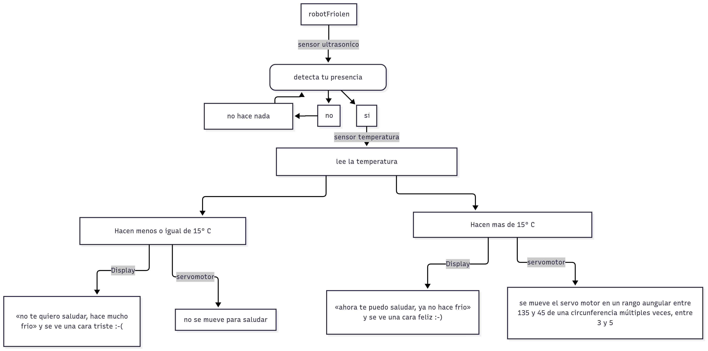
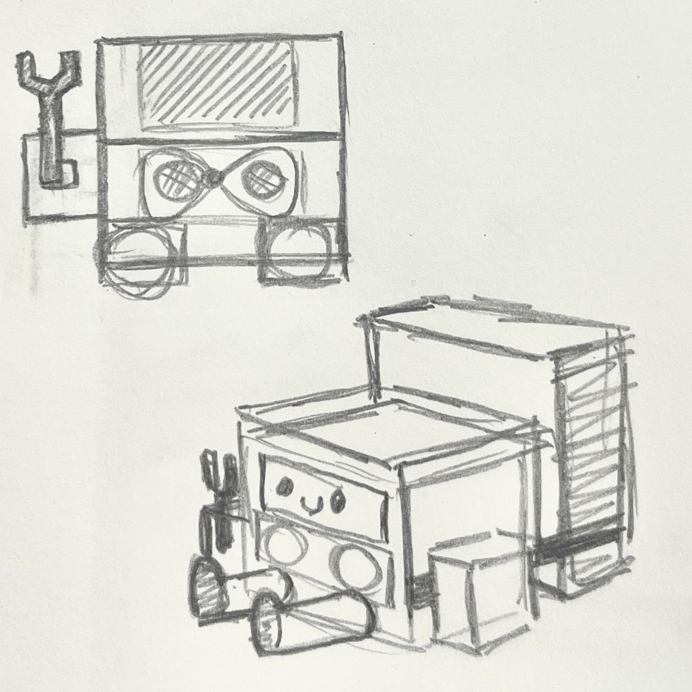
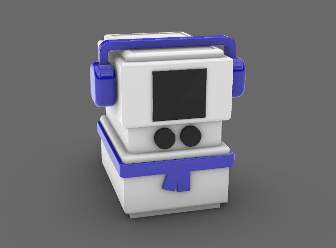
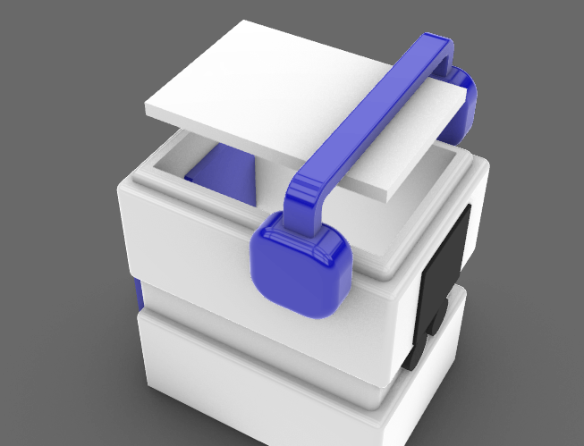
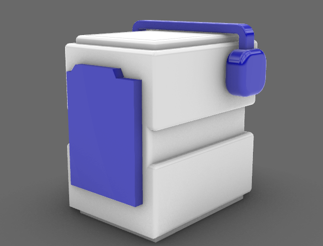
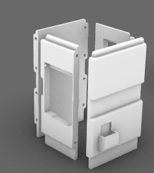
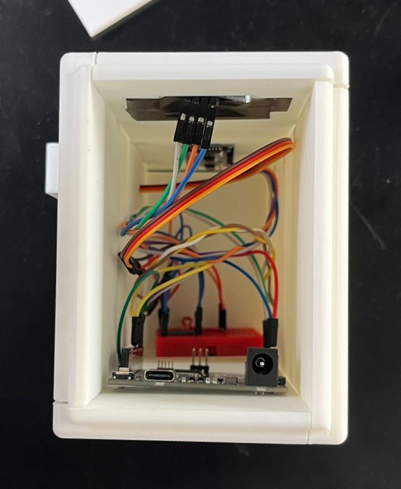

# Proyecto 02

## Grupo-05 "Waos" : Integrantes y roles del Equipo

**Morgan Aravena Arze** // Investigación, creación del pseudocódigo, organización de código y pseudocódigo a lo largo de todo el proyecto, clasificación del código a clases, armado y prototipado de la pieza final.

**Aileen Guiselle D'Espessailles Rojas** // Investigación, incorporación del sensor ultrasónico, incorporación de funcionamiento de display, modelado 3d de carcasa, armado y prototipado de la pieza final.

**Carla Andrea del Carmen Pino Barrios** // Investigación, incorporación del sensor ultrasónico, incorporación de funcionamiento de display, creación de imágenes para la pantalla, armado y prototipado de la pieza final.

**Sebastián Alejandro Sáez Olivares**  // Investigación,  clasificación del código a clases, incorporación del sensor temperatura, incorporación pantalla y servo motor, implementación del texto en pantalla, armado y prototipado de la pieza final.

## Presentación textual

¿Alguna vez han tenido algún amigo que es tan, pero taaaan friolento que cuando siente frío, ni siquiera se mueve de su lugar como para saludarte?

Pues nosotres sí, su nombre es ☃️❄️ Friolín ❄️☃️, un muñeco de nieve que no se da cuenta de que la razón por la que tiene tanto frío en tantos lugares distintos es porque está hecho de nieve.

Este curioso muñeco solo nos saluda cuando se siente a gusto, rehusándose a saludar con 🌡️temperaturas que, personalmente, no consideramos muy frías, 20°… 30°… ¡incluso 🔥40°🔥!

Todo depende del día, cómo se siente y la temperatura del ambiente, si te lo encuentras alguna vez, acércate a él y espera a ver si eres🍀afortunadx🍀 como para recibir un saludo suyo.

### Introducción

El proyecto, de manera general, consiste en hacer una máquina que salude.

Para la ideación del proyecto usamos la propuesta de SebastianSaez1003, que quería usar un servomotor desde el semestre pasado.

Nuestro proyecto se centra en desarrollar un robot que te salude dependiendo de la temperatura que siente.

El saludo se define como "un acto comunicacional (entre humanos), en el que una persona hace notar a otra su presencia" [- Wikipedia.](https://es.wikipedia.org/wiki/Saludo)

En nuestro caso, romperíamos un poco esta definición debido a que el saludo que se llevaría a cabo sería entre máquina (Friolín) y humano.

Como método de saludo específico, definimos que se realizaría a través de palabras y el movimiento de un brazo.

En nuestro caso, los sensores presentes serían de temperatura y un sensor ultrasónico, mientras que los actuadores serían un servomotor y una pantalla.

### Friolin

Friolín, nuestro robot friolento, funciona con un sensor ultrasónico HC-SR04, que usaremos para detectar si hay o no hay alguien frente al robot, un sensor DHT11, que es de temperatura, humedad y presión; en nuestro caso solo utilizaremos la función de medir la temperatura ambiental, una pantalla OLED SSD1306, para mostrar una retroalimentación visual con características faciales; y un servomotor, para que cometa el acto de saludar con un brazo que le daremos al robot.

#### Paso a paso del proyecto

1. La máquina inicia en estado neutro, donde Friolín se encuentra durmiendo.
2. Si no detecta a nadie se mantiene en este estado, en donde su mano estará en suspensión y en la pantalla se intercala entre una cara dormilona y “ZZZ”, que es la onomatopeya comúnmente usada cuando alguien está durmiendo.
3. Si detecta a una persona, se pasará al siguiente check, el cual será de cual es la temperatura actual.
4. Si la temperatura es menor o igual a (15) grados celsius, el servomotor no actuará y mostrará en display un mensaje del porqué no quiere saludar, la cual es el hecho de que tiene frío, además de una expresión facial que refleja su incomodidad con el frío del ambiente mediante texto que se puede observar en el display.
5. Si la temperatura es mayor a (15) grados celsius, el servomotor actuará para dar el saludo (donde su "brazo" se moverá de lado a lado entre los grados 135 y 45 para simular un saludo de mano como lo realizaría un humano) y se mostrará en display un mensaje de texto para saludar, junto a una expresión facial acorde a su felicidad.
6. El ciclo del saludo del brazo se repetirá 3 veces, para poder dar tiempo a que se observe todo lo que Friolin le quiere decir a esta persona.
7. La persona al retirarse hará que la máquina vuelva a su estado neutro y Friolín volverá a dormir.

Este recorrido se puede visualizar mediante el siguiente diagrama de flujo:

### Desarrollo

Para poder programar a friolin de manera más fácil partimos con el desarrollo del pseudocódigo donde se separaron las funciones de cada sensor y actuador en archivos. H y .cpp para que el archivo .ino quedará todo ordenado, se partió con la ideación de los parámetros de cada sensor, para poder comenzar con la investigación exacta de que queríamos hacer.
En este punto del pseudocódigo también se definieron las clases, donde, con la ayuda de Aarón Moraga pudimos definir cada una de las acciones que queríamos que se desarrollaran. (Las clases se hicieron en el archivo .cpp y los parámetros en .h)

Luego de ver todos los parámetros nos separamos por investigación de sensor/actuador y por la persona que uniría todo en el código madre.

## Changelog

  
 Extender para visualizar CHANGELOG completo 

###[pseudocodigoV0](https://github.com/disenoUDP/dis8645-2025-02-procesos/tree/main/03-Mosswhosmoss/sesion-07b)

Morgan trabajo en esta versión del pseudocodigo donde se hizo la separación de tabs dentro del archivo, por el momento solo con archinos .ino

### [pseudocódigo V0_1_4](https://github.com/disenoUDP/dis8645-2025-02-procesos/tree/main/03-Mosswhosmoss/sesion-07b)

Morgan llegó a la versión final del pseudocódigo, donde existen muchos errores, pero con la ayuda de Aaron Montoya Moraga empezamos a ordenar y resumir los archivos llegando a la primera versión de codigoRobotFriolento.ino.

### codigoRobotFriolento_0_1_0

Morgan realizó la primera versión de “código” oficial, se rescatan esqueletos del pseudocódigo pero el enfoque es disminuir la cantidad de archivos (tanto .h y .cpp) dentro de la carpeta, básicamente partir de lo más general, para que de esa manera sea más fácil avanzar y ordenar.

### codigoRobotFriolento_0_1_1

Morgan identificó errores en la definición de los parámetros entre archivos .h y .cpp.

### codigoRobotFriolento_0_2_0

Morgan junto al profesore Aarón continuaron con el desarrollo y orden de la clase SensorUltra, ya que en la versión anterior ocurrían errores respecto a los parámetros debido al desorden entre los archivos .h y .cpp.

### codigoRobotFriolento_0_2_1

Morgan gracias a la ayuda de Aarón empezó con el desarrollo de la clase SensorTemp, que compilaba correctamente.

### codigoRobotFriolento_0_2_2

Sebastián se guió por el archivo del sensor Ultrasónico, que ya estaba ligeramente con el formato correcto para su funcionamiento, donde se llegó a una implementación correcta del sensor de temperatura, pero era una traducción directa de el código de ejemplo, así que se comentaron la mayor cantidad de líneas posibles para explicar el funcionamiento y las razones del porqué se dividió el código original de esa manera.

### codigoRobotFriolento_0_2_3

Aileen agregó el sensor ultrasónico como .cpp y .h, que determina si había una persona cerca o no en el serial monitor de forma exitosa. 

### [codigoRobotFriolento_0_2_4](https://github.com/disenoUDP/dis8645-2025-02-procesos/tree/main/27-SebastianSaez1003/sesion-09a) 

Sebastián implementa el funcionamiento del servomotor, como también los movimientos que iría a realizar en el futuro el “brazo” del robot.

### codigoRobotFriolento_0_2_5

Aileen junto a Carla se enfocaron en la pantalla, que fue el último actuador en ser incorporado, la cual se había intentado usar la GC9A01 pero al momento de hacerla funcionar, no daba respuesta alguna, por lo que se decidió usar el display SSH1106, que funciona, pero contienen glitches al momento de cambiar de texto.

###[codigoRobotFriolento_0_3_0](https://github.com/disenoUDP/dis8645-2025-02-procesos/tree/main/27-SebastianSaez1003/sesion-09a)

Sebastián junto a Aarón llevaron a cabo la intercomunicación de 2 de los componentes, debido a que todo previamente era anexo a uno del otro, creando una primera condicional en el archivo .ino, empezando a usar las clases de manera eficiente.

establece definitivamente el movimiento del brazo, dejando los ángulos del movimiento escritos como “int”.

###[codigoRobotFriolento_0_3_1](https://github.com/disenoUDP/dis8645-2025-02-procesos/tree/main/27-SebastianSaez1003/sesion-09a)

Sebastián define un “for” que permite el movimiento de el brazo una cantidad determinada de veces antes de volver al estado neutral.

### codigoRobotFriolento_0_4_0

Morgan agrega los códigos que ha desarrollado el equipo a un archivo de mejor calidad, se incluyen los parámetros para los sensores tanto de temperatura como el ultrasónico, en el caso de los actuadores solo se encuentran funcionando los parámetros de la pantalla, Sebas seguía trabajando con el servo.

### codigoRobotFriolento_0_4_1

Morgan se agrega los parámetros del servo y se deja funcionando, en el archivo .ino queda una función pendiente para mover al archivo .cpp y .h del servo.

### codigoRobotFriolento_0_4_2

Carla implementa las 2 primeras imágenes junto al código que accionará estas imágenes dependiendo de las variables del clima (no compilaba correctamente).

### codigoRobotFriolento_0_4_3

Carla dejó esta versión de respaldo al tener el código funcional de una sola imagen en la pantalla.

### codigoRobotFriolento_0_4_4

Carla demostró que código como tal fue usado pero no se mostraban las imágenes de las pantallas ni reaccionan los demás componentes.

### codigoRobotFriolento_0_4_7
Carla hizo la parte de la pantalla después de varios intentos, se llegó a un resultado que sí llegó a compilar correctamente, con ambas caras que teníamos en aquel momento. El problema es que el sensor ultrasónico dejó de funcionar y detectar la distancia. Por lo tanto, con la ayuda del equipo, se utilizó el código ya hecho y se ordenó de mejor manera, para luego hacer otra versión donde tanto la pantalla como el sensor ultrasónico podían funcionar a la vez.

Se cambió el código del display, ya que se identificó un error muy grave que causaba un ralentizamiento de todos los demás componentes de manera potente, como también se pudieron encontrar los errores previos respecto la deformación de las palabras, decidiendo dejar de usar el display SSH1106 para usar el OLED1306 con el que ya estábamos familiarizados.

### [codigoRobotFriolento_0_5_0](https://github.com/disenoUDP/dis8645-2025-02-procesos/tree/main/27-SebastianSaez1003/sesion-09b)
Sebastián específico muchos de los comentarios que estaban muy vagos, para poder definir la función que realizaban en el proyecto.

Se implementó un archivo header en que que se dispondrá la información de los bitmaps de las caras que Friolín mostrará, esto con la intención de que el archivo header del display pueda ser más legible y comprensible.

Se implementaron las condiciones definitivas para el funcionamiento final de Friolín, que son:  

- Si es que no se detecta a nadie con el sensor Ultrasónico, no se moverán los servomotores en absoluto y la “cara” de nuestro robot estará en un estado neutro.  

- Si es que se detecta a una persona y la temperatura ambiente es mayor a 15 grados (dato que se puede cambiar), el robot tendrá una expresión feliz, para poder demostrar que está a gusto, mientras mueve su brazo a forma de saludo.  

- Si es que se detecta a una persona y la temperatura ambiente es menor a 15 grados (dato que se puede cambiar), el robot tendrá una expresión de desagrado, donde expresaba su disgusto a el frio que hace, algo que se puede observar en su cara y el hecho de que no quiere saludar con su brazo.  

###[codigoRobotFriolento_1_0_0]

Sebastián le agrego una cara “durmiendo” a Friolín para su modo standby que fue creada por Carla, cambio el orden de acciones en el “void loop” del archivo .ino para que no existiese un a pausa considerable cuando se detectaba a una persona y intentaba cambiar la cara que se observaba en el display, como se puede observar en el siguiente video: 

###[codigoRobotFriolento_1_0_1]

Sebastián implementa las correcciones que realizó Aarón como buenas prácticas para la organización del código, como también se comenta la gran mayoría de elementos del proyecto.

###[codigoRobotFriolento_1_0_2]

Sebastián agregó texto que dara contexto a la situación en la que se encuentra Friolin, que seria visualizado en el display, pero esto causó otro problema, debido a que para el cambio entre texto y las caras se estaba ocupando delay, esto impedía el funcionamiento rápido de los demás sensores y actuadores, causando que sea poco responsivo.

###[codigoRobotFriolento_1_0_3]

Sebastián intentó cambiar el uso de delay() hacia millis() dentro de los archivos correspondientes al display, pero no se logró de manera correcta, debido a que las pantallas cambiaban con una velocidad muy alta, o ni siquiera cambiaban dependiendo de el tiempo que se les aplicará, no existía un punto intermedio.

## Carcasa 

Aileen se dedicó completamente a llevar a cabo la carcasa de Friolín, trayendo las ideas fantasiosas a la realidad.

En un principio habíamos visto como un robot amigable, similar a nuestro moodboard, después de varios bocetos se dio la idea de que sea friolin

La idea principal de la carcasa es que contenga y exponga todos los componentes de manera eficiente, también su forma de hombre de nieve hace alusión de forma irónica a su miedo al frío. Además, su forma geométrica se eligió para ser similar al pixel art de las imágenes. También se realizaron piezas extras como sus orejeras y brazo para personificar y dar mayor personalidad al proyecto.

### BOM (Bill of Materials)

| Sensor / Actuador               | Especificacion | Precio | Link de compra                                                                                                                                                                 |
| ------------------------------- | -------------- | ------ | ------------------------------------------------------------------------------------------------------------------------------------------------------------------------------ |
| Servomotor                      | SG90           | $1.990 | [https://afel.cl/products/micro-servomotor-sg90?_pos=1&_sid=e6931ef89&_ss=r](https://afel.cl/products/micro-servomotor-sg90?_pos=1&_sid=e6931ef89&_ss=r)                       |
| Sensor Ultrasónico              | HC-SR04        | $1.500 | [https://afel.cl/products/sensor-de-ultrasonico-hc-sr04?_pos=1&_sid=1a8918b48&_ss=r](https://afel.cl/products/sensor-de-ultrasonico-hc-sr04?_pos=1&_sid=1a8918b48&_ss=r)       |
| Sensor de Temperatura y Humedad | DHT11          | $2.300 | [https://afel.cl/products/sensor-de-temperatura-y-humedad-dht11](https://afel.cl/products/sensor-de-temperatura-y-humedad-dht11)                                               |
| Pantalla 1.3" 128x64 | 1306 LCD Oled  | $5.000  | <https://afel.cl/products/pantalla-lcd-oled-1-3-128x64-caracteres-blancos>  |

### Comentarios finales

El desarrollo de Friolín nos permitió explorar de forma creativa la relación entre tecnología y comportamiento. Más que un simple ejercicio técnico, el proyecto nos llevó a pensar cómo un conjunto de sensores y servomotores puede transmitir intención y carácter.

