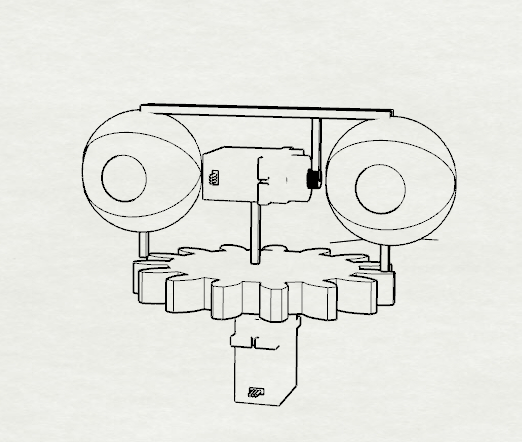
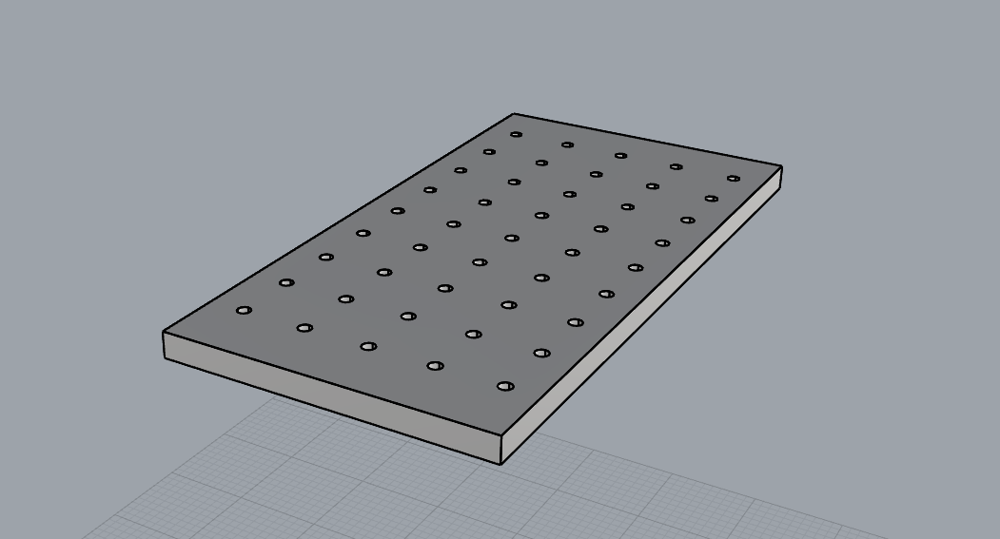
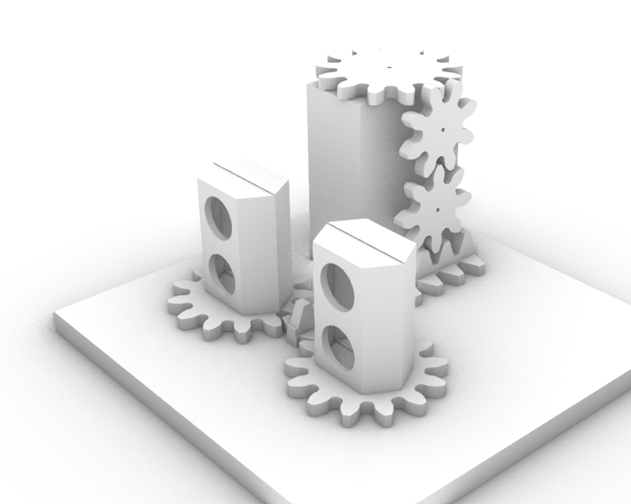
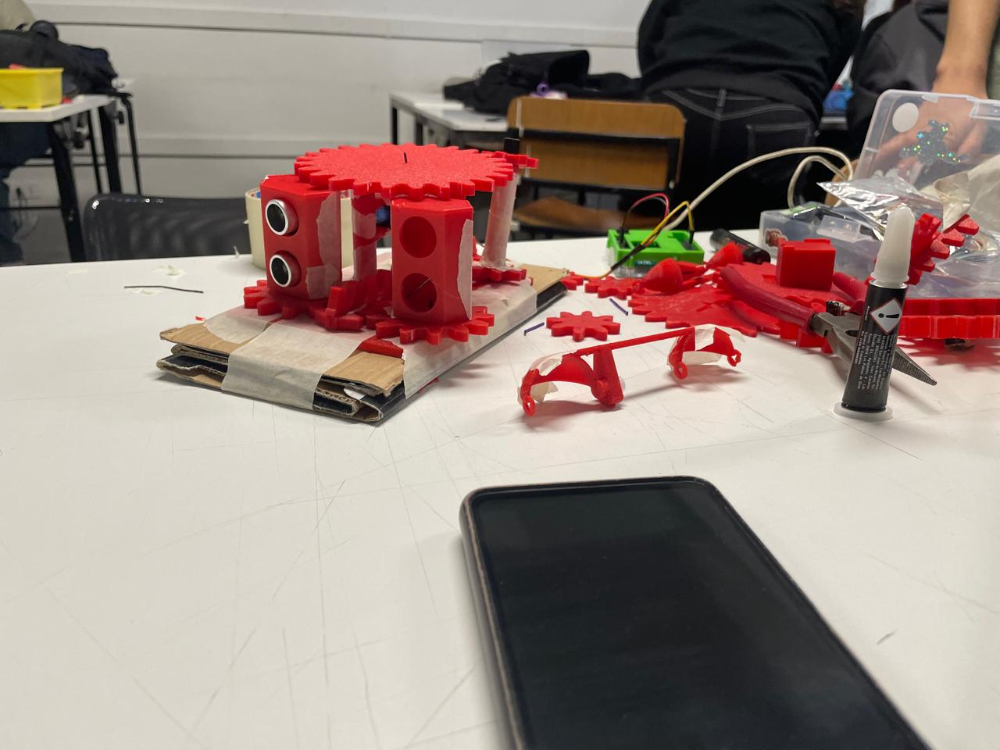
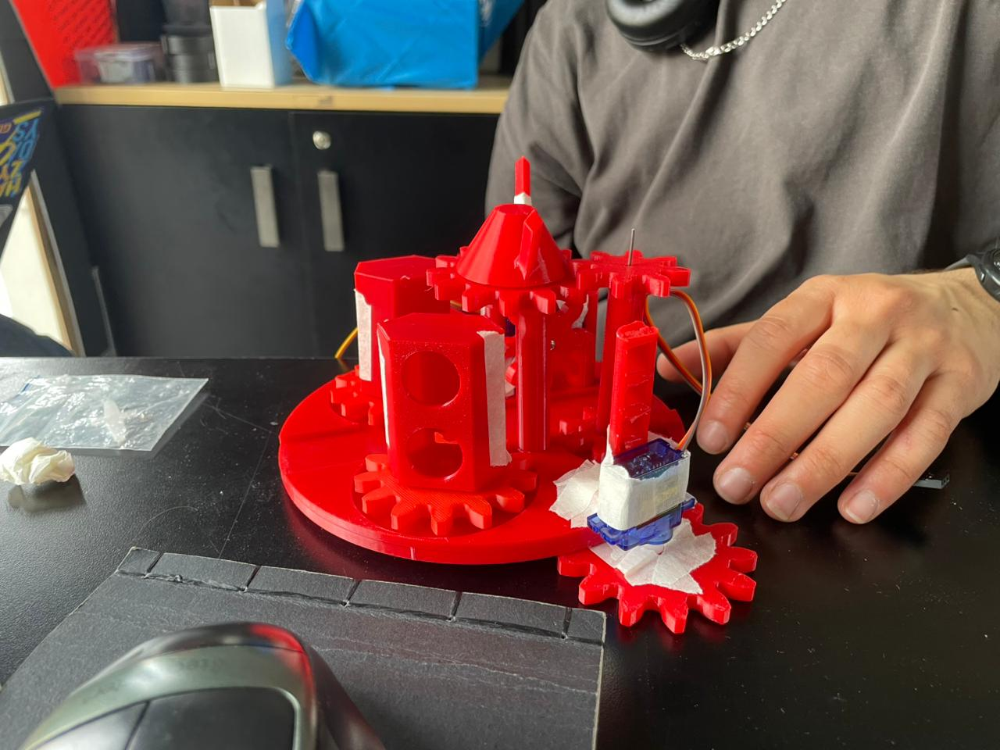

# Proyecto 02

- Grupo: 06
- Nombre de grupo: Hijos de la Tierra
- Integrantes:
 - Antonia Fuentealba Pessot / [AntFuentealba](https://github.com/AntFuentealba) 
 - Santiago Gaete Fernández / [santiagoClifford](https://github.com/santiagoClifford) 
 - Sofía Pérez Muñoz / [sofia-perezm](https://github.com/sofia-perezm) 
 - Félix Rodríguez Guevara / [felix-rg416](https://github.com/felix-rg416) 

## Roles del equipo
- Antonia Fuentealba Pessot: Investigación de códigos, propuestas sobre el proyecto, experimentación con componentes y documentación en github.
- Santiago Gaete Fernández: Modelado 3d y armado , sistema de engranajes, investigación de códigos y estructura, experimentación con componentes y bocetos.
- Sofía Pérez Muñoz: Investigación de códigos, propuestas sobre el proyecto, experimentación con componentes, documentación en github, investigación de referentes y como se relacionan con el concepto.
- Félix Rodríguez Guevara: Modelado 3d y armado, investigación, estructura, armado y resolución de código, y experimentación con componentes.

## Presentación textual

### Lil Brother

Como primera propuesta, usamos la idea de [AntFuentealba](https://github.com/AntFuentealba), que consistía en una máquina que te siguiera con la mirada.

Desglosando esta idea llegamos a la conclusión de que esta "mirada" debía activarse cuando se detectara de alguna forma una presencia.

Finalmente nuestro proyecto es una máquina con ojos que reacciona ante la presencia de una persona. En su estado normal, la base en donde están los ojos se mueven constantemente de un lado a otro y pestañean en un ciclo continuo, como si estuvieran explorando el entorno. Este movimiento se logra, gracias a un conjunto de engranajes, que sumados al movimiento que entregan los servos, logra mover toda la estructura.

Cuando el sensor ultrasónico detecta a alguien cerca, la máquina se detiene y queda “mirando” fijamente, dejando de pestañear, como si reconociera la presencia y le impactara esta misma.

Al momento en que la persona se aleja, el sistema entra en un estado de alivio y vuelve a su comportamiento inicial, retomando el movimiento y el parpadeo en bucle.

### Mapa de flujo


## Inputs y outputs

Componentes a utilizar:

- Sensores ultrasónicos (2), sensor de proximidad HC-SR04
- Servomotores (3)

### Input

Mediante los sensores ultrasónicos, la máquina detecta si existe o no presencia de un sujeto u objeto. Esto mediante el movimiento de los sensores a través de servomotores, además la estructura tiene unos ojos que parpadean constantemente mientras está buscando que detectar.

### Output

Al detectar cualquier tipo de presencia, se queda mirando fijamente a la dirección en donde se haya sensado, y el pestañeo se detiene.

## Bocetos y acercamientos

En la primera etapa teniamos pensado como grupo el usar dos micrófonos MAX4466, y que através de estos se pudiera detectar sonido y esto activara el movimiento de servomotores para mover los ojos. Sin embargo esta primera idea fue desechada por complicaciones en el funcionamiento de los micrófonos.


Croquis inicial explorando el mecanismo y el movimiento deseado del sistema interactivo.


Segunda iteración del croquis, afinando proporciones y ubicación del sensor y el servo.

## Pseudocódigo y experimentación

En un principio, lo que decidimos hacer, era probar como se movía el servomotor, y en base a esto ir decidiendo un rango, para definir la fluidez de movimiento que queriamos que tuviera. A continución se puede ver un extracto de código que utilizamos para probar el movimiento del servo.

```cpp
// Incluímos la librería para poder controlar el servo
#include <Servo.h>
 
// Declaramos la variable para controlar el servo
Servo servoMotor;
 
void setup() {
  // Iniciamos el monitor serie para mostrar el resultado
  Serial.begin(9600);
 
  // Iniciamos el servo para que empiece a trabajar con el pin 9
  servoMotor.attach(9);
 
  // Inicializamos al ángulo 0 el servomotor
  servoMotor.write(0);
}
 
void loop() {
 
  // Vamos a tener dos bucles uno para mover en sentido positivo y otro en sentido negativo
  // Para el sentido positivo
  for (int i = 0; i <= 180; i++)
  {
    // Desplazamos al ángulo correspondiente
    servoMotor.write(i);
    // Hacemos una pausa de 25ms
    delay(25);
  }
 
  // Para el sentido negativo
  for (int i = 179; i > 0; i--)
  {
    // Desplazamos al ángulo correspondiente
    servoMotor.write(i);
    // Hacemos una pausa de 25ms
    delay(25);
  }
}
```

Para ver más documentación sobre este proceso con imágenes y gifs, recomiendo visitar los repos linkeados al principio del readme.

## Etapas del código

### Etapa 1: creación de las clases

#### Párpados

```cpp
  Parpados();
  ~Parpados();

  void configurar();
  
  void moverMotorcillo(int angulo, int tiempo);

  Servo motorcillo;
};
```

#### Cuello

```cpp
  Cuello();
  ~Cuello();

  Servo motorcillo;

  void configurar();

  // void moverMotorcillo(int angulo, int tiempo);
  void moverCuello();

  void amenaza();
};
```

#### Sensor de proximidad

```cpp
  SensorProx();
  ~SensorProx();

  void configurar();
  void leer();
  void imprimirEnConsola();
  void determinarPresencia();
  // void presencia();
  // void nada();
  int patitaTrigger = 9;
  int patitaEcho = 10;
  float duracion = 0;
  float distancia = 0;
  bool presencia = false;
};
```

### Etapa 2: creación archivos .cpp

```cpp
void Parpados::configurar() {
  Parpados::motorcillo.attach(7);
}

void Parpados::moverMotorcillo(int angulo, int tiempo) {
  motorcillo.write(angulo);
  Serial.print("el ángulo del párpado es:");
  Serial.println(angulo);
  delay(tiempo);
}

// // referente de como reducir el código
// // <https://arduino.stackexchange.com/questions/66378/servo-motor-in-function>
```

```cpp
void Cuello::configurar() {
  Cuello::motorcillo.attach(8);
}

void Cuello::moverCuello() {
  // sentido positivo
  for (int i = 0; i <= 180; i++) {
    // servoMotor.write(i);
    delay(25);
  }
  // sentido negativo
  for (int i = 179; i > 0; i--) {
    Cuello::motorcillo.write(i);
    delay(25);
  }

// void Cuello::amenaza() {
// que se diriga a la posicion de los sensores
// }
}
```


### Etapa 3: archivo .ino

#### Incluir bibliotecas y clases

```cpp
#include "constantes.h"
#include "SensorProx.h"
#include "Cuello.h"
#include "Parpados.h"
#include "ServoSensores.h"
#include <Servo.h>
#include <Arduino.h>
```

#### Inicio prueba y error del código

```cpp
void setup() {
  cuello.configurar();
  parpados.configurar();
  sensorProxIZQ.configurar();
  // inicia monitor serial
  Serial.begin(9600);
}
```

Nuestro compañero Sebastián Saez / [SebastianSaez1003](https://github.com/SebastianSaez1003) nos ayudó a armar el código y además nos dio instrucciones y pasos a seguir. A continuación, se muestra un extracto del código en el que nos ayudó:

```cpp
// Mostrar ángulo actual del servo de sensores
     int anguloActual = sensores.getAnguloActual();
     Serial.print("ServoSensores en ángulo: ");
     Serial.println(anguloActual);

     delay(500);
   } else {
     unsigned long ahora = millis();
```

Dentro del proceso del código tuvimos la ayuda de todo el equipo docente y algunos compañeros. Fue muy importante para nuestro trabajo buscar puntos de vista de otras personas.

> Gracias sobre a todo a Mateo que nos ayudó hasta en los errores más pequeños.

### Código final

Finalmente, luego de estar mucho tiempo intentando que las clases funiconarar. Decidimos hacer un sólo archivo que contuviera todo lo necesario para que funcione.

Actualmente, nuestro código hace girar los servos sin un sensor ultrasónico. En vez de los sensores estamos usando el monitor serial para definir el ángulo que gira el servo "cuello"

## Carcasas y prototipos

Para el primer acercamiento, nuestro proyecto constaba de una base con unos ojo que simulaban un parpadeo y se movía en una rotación de 180°.



Más adelante [santiagoClifford](https://github.com/santiagoClifford), ideo un mecanismo en base a distintos engranajes para lograr mover los distintos servos integrados.


Finalmente, [santiagoClifford](https://github.com/santiagoClifford) junto con [felix-rg416](https://github.com/felix-rg416), mejoraron el sistema de engranajes, haciendo adaptaciones para la correcta instalación y fijación de las distintas partes del proyecto, y haciendo que la base también contara con un sistema de rotación en base a engranajes.


## Documentación y procesos

### Prototipado y mecanismos


Diseño preliminar del engranaje que transmite el movimiento del servo al mecanismo.



Sistema en protoboard con conexión del servo y sensor ultrasónico


Vista del archivo en el slicer antes de imprimir las piezas 3D de los engranajes.

### Pruebas de movimiento


Ensayo inicial del engranaje con el sensor ultrasónico montado.


Versión mejorada con ajustes en el eje y velocidad de rotación.


Iteración final mostrando un movimiento fluido y sincronizado del mecanismo completo.


Probando el sensor de proximidad

### Modelado 3D y renderizado



Render final del mecanismo ensamblado con sensor y estructura.


Serie de capturas del proceso de modelado 3D, mostrando las distintas etapas de diseño, ajustes y refinamiento del sistema.






### Estructura y componentes


Diseño de la pieza estructural donde se monta el sistema mecánico.


Carcasa del sensor ultrasónico diseñada para proteger y alinear la lectura.


Detalle del acoplamiento entre el sensor y la línea de engranajes.

## Referentes

### Estéticos

Para este proyecto quisimos que tuviera una aparencia mas brutalista, que cause rechazo el verlo, por esta razón decidimos no hacer una carcasa que contuviera todos los componentes, en cambio decidimos hacer una extructura abierta, dejando cables expuestos y logrando visualizar cada pieza del proyecto fácilmente

Para entender un poco la estética de nuestro proyecto nos basamos en los siguientes referentes:

- 1984 de George Orwell - Para dar la sensación de sentirse vigilado constantemente
- [Around the world - Daft Punk](https://www.youtube.com/watch?v=K0HSD_i2DvA) - Para la estructura en sí, tipo circular, con engranajes que rotan y estructuras con diferentes niveles y alturas.

### Musicales

El concepto de la paranoia ha sido trabajado múltiples veces por grandes exponentes de la música. Cada uno de ellxs dando su punto de vista de cómo es afectadx por la paranoia, y como ésta se manifiesta en sus vidas.

- [Paranoid Android - Radiohead](https://youtu.be/Lt8AfIeJOxw)
- [CHROMAKOPIA - Tyler, The Creator](https://youtu.be/hCcwCv3G1FQ)
- [Paranoid - Black Sabbath](https://youtu.be/fWvKvOViM3g)
- [Paranoid Eyes - Pink Floyd](https://youtu.be/ALuor5QREgw)
- [Imogen Heap - Headlock](https://youtu.be/roPiy2JydwA)

## Reflexiones personales

### [AntFuentealba](https://github.com/AntFuentealba):

Este proyecto fue un desafío complejo para mí, marcado tanto por momentos de satisfacción como por altos niveles de frustración. Uno de los principales retos fue la parte del código; desde el inicio, la integración de los servomotores y los sensores ultrasónicos generó mucha confusión. Hubo instantes en que sentí que el proyecto se me escapaba de las manos, especialmente cuando los sensores no respondían como esperábamos o los servos se movían de manera inesperada. Aprender a manejar estas dificultades me obligó a ser paciente, investigar más a fondo, y confiar en la colaboración con mis compañerxs y con Sebastián Saez, quien nos guió y nos entregó instrucciones clave para avanzar.

Por otro lado, trabajar en la documentación, los bocetos y el seguimiento del prototipo me permitió sentir que cada avance, por pequeño que fuera, nos acercaba a nuestro objetivo. Ver cómo el mecanismo finalmente se movía de manera fluida, y cómo los ojos reaccionaban ante la presencia de una persona, fue tremendamente gratificante.

En resumen, aunque fue un proceso desafiante y muchas veces complejo, especialmente en la parte del código, este proyecto me enseñó la importancia de la paciencia, la colaboración y la iteración constante. Los errores y confusiones se convirtieron en oportunidades de aprendizaje, y el resultado final reflejó el esfuerzo colectivo y la perseverancia de todo el grupo.

### [santiagoClifford](https://github.com/santiagoClifford) :

Mi principal tarea en este proyecto fue el diseño y frabricación ddl circuito mecánico que impulsa el robot. Debido a limitaciones temporales, las fases de diseño, fabricación y prototipado, se vieron difuminadas entre sí. Esto provocó un efecto de "tunnel vision" en mí, y me concentré tanto en estudiar los engranajes y los mecanismos propios del robot, que dejé de lado otros aspectos igual de importantes. Como reflexión puedo decir que para otras ocasiones me gustaría hacer el esfuerzo de, por momentos, desconectarme del proyecto, con el objetivo de poder evaluarlo desde una perspectiva menos personal.

### [sofia-perezm](https://github.com/sofia-perezm)

Personalmente, una de las cosas que más me costó fue que el proyecto se fue haciendo más difícil y técnico, lo que me generó bastante frustración y estrés. Hubo momentos en los que sentí que no estaba al mismo nivel que mis compañeros, y eso me hizo dudar de mis capacidades. A pesar de que el proyecto me gusta mucho y encuentro que la idea es muy interesante, esas emociones estuvieron muy presentes y afectaron mi rendimiento. Sin embargo, también me hicieron darme cuenta de hasta dónde puedo llegar, y aprender a reconocer mis propios límites cuando las cosas se vuelven demasiado exigentes. Fue un proceso intenso, pero también un aprendizaje importante sobre cómo manejar la presión y la frustración.

Pensando a futuro, creo que este proyecto tiene mucho potencial para seguir desarrollándose. Me gustaría mejorar los movimientos para que se vean más naturales y quizás agregarle luces o algún tipo de sonido que refleje emociones, haciendo que la interacción con la máquina sea más viva y expresiva. Todo lo aprendido en este proyecto me deja con una mirada más consciente sobre lo que implica trabajar con tecnología: no solo se trata de programar o armar circuitos, sino también de lidiar con el cansancio, la paciencia y la autoconfianza.

### [felix-rg416](https://github.com/felix-rg416) :

El primer desafío que tuvimos fue unificar ideas y poder llegar a lo que seria la forma final del proyecto. Luego se partió con el modelado, lo que no tuvo mayores dificultades, solo arreglos para lograr un optimo funcionamiento. La verdadera complicación vino con la elaboración del código. En esta parte del proceso me sentí muy frutado y debo reconocer que falle a la hora de realizar la investigación de referentes lo que me llevo a equivocarme muchas veces en detalles mínimos que nos fueron atrasando. 

Al inicio intente dividir el código en carpetas para organizarme de mejor manera y que fuera mas limpio. Pensé que sería una gran idea, pero terminó siendo más difícil, así que quedó en un sólo código. La elaboración final del código fue hecha en conjunto donde aportamos varios puntos de vista para salir de los problemas que se iban presentando. Todo esto con ayuda de compañeros y el equipo docente.

Personalmente, se me dificultó el tema de las clases, me costó mucho lograr hacer que tuvieran sentido entre sí. Siento que tengo que mejorar mucho en el área de investigación, porque, gracias a eso, hubiera podido hacerlo de forma más fácil y rápida. Me hubiese gustado haber resuelto antes algunos problemas y aunque me cuesta mucho trabajo reconocer virtudes en mi, si me enorgullezco de mi persistencia y mi capacidad de pedir ayuda.

## Bibliografía

- Ikkalebob. (s. f.). *[How to make ultra realistic eyes using 3D printing and casting](https://www.instructables.com/How-to-Make-Ultra-Realistic-Eyes-Using-3D-Printing/?linkId=76371911)*. Instructables.

- Ikkalebob. (s. f.). *[Simplified 3D printed animatronic dual eye mechanism](https://www.instructables.com/Simplified-3D-Printed-Animatronic-Dual-Eye-Mechani/)*. Instructables.

- Maker101io. (s. f.). *[Face with animatronic eyes, motion detection and voice](https://projecthub.arduino.cc/maker101io/face-with-animatronic-eyes-motion-detection-and-voice-acc4ad#section5)*. Arduino Project Hub.

- STL Gears. (s. f.). *[3D print gear generator](https://www.stlgears.com/generators/3dprint)*.

- Naylamp Mechatronics. (s. f.). *[Tutorial: uso de servomotores con Arduino](https://naylampmechatronics.com/blog/33_tutorial-uso-de-servomotores-con-arduino.html)*.

- Dezmon. (2021, March 8). *[Animatronic eyes – simple 3D printable model](https://www.thingiverse.com/thing:4792196)*. Thingiverse.

- Spencer, C. (2014). *[Gears: Python library for gear generation](https://github.com/chrisspen/gears)*. GitHub.

- Programar Fácil. (2020, August 12). *[Servomotor con Arduino](https://programarfacil.com/blog/arduino-blog/servomotor-con-arduino/)*.

- Proyecto Arduino. (2020, June 5). *[Sensor de ultrasonidos: medir distancia con Arduino](https://proyectoarduino.com/sensor-de-ultrasonidos-medir-distancia-con-arduino/)*.

- Naylamp Mechatronics. (s. f.). *[Tutorial de Arduino y sensor ultrasónico HC-SR04](https://naylampmechatronics.com/blog/10_tutorial-de-arduino-y-sensor-ultrasonico-hc-sr04.html)*. Naylamp Mechatronics.

- Arduino. (s. f.). *[BlinkWithoutDelay](https://docs.arduino.cc/built-in-examples/digital/BlinkWithoutDelay/)*. En *Ejemplos integrados de Arduino: Digital*.


