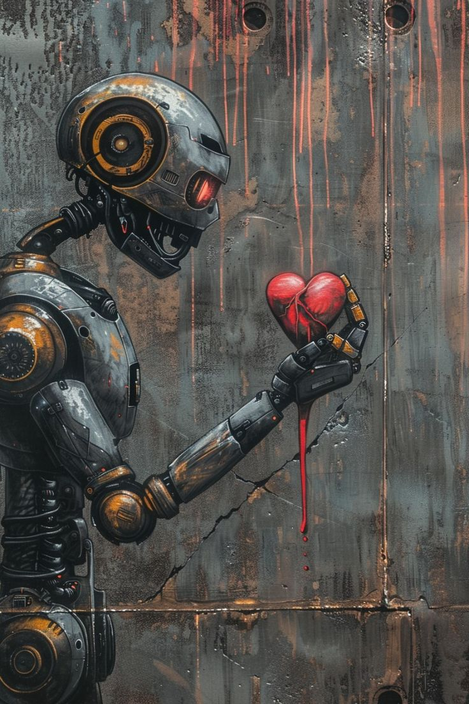

# sesion-11b

[Traducción](https://es.wikipedia.org/wiki/Traducción)

[TranSducción](https://es.wikipedia.org/wiki/Transducción)

[metáfora](https://es.wikipedia.org/wiki/Metáfora)

[OOO](https://es.wikipedia.org/wiki/Realismo_especulativo)

[Graham Harman](https://en.wikipedia.org/wiki/Graham_Harman) es un filósofo, relativamente reciente, él vela en contra de los filósofos e ideas, que proponen que todo es lenaguaje. Pero él cree que todo existe independiente del lenguaje. "el lenguaje es un reflejo pobre de la realidad"

Graham estudia la cosmología. Postula que debemos tratar de explicar el universo y dejar de enfocarnos en solo nuestra sociedad.

## diseño orientado a objetos (OOD)

hablemos de mesas. Graham tiene un texto que se llama [la tercera mesa](https://publicaciones.umich.mx/revistas/devenires/ojs/article/view/201/173)

¿qué es una mesa? ¿cómo le explicamos una mesa a alguien que no las entiende?

una "interfaz de altura", superfiecie para colocar cosas, tiene 4 patas, cubierta de melamina, etc.

en el fondo, todas estas definiciones/explicaciones, responden a 1 de 2 opciones:

1. cualidades materiales --> atributo(variable en una clase)
2. relaciones/funciones --> método(una función dentro de un objeto)

(este paradigma, contextualizado en programación, se llama programación orientada a obejtos(OOP).)

Todas estas cualidades no son intrínsecas de la mesa, nos sirven también para definir otras cosas.

Cuando definimos un objeto solo por sus materialidad, Graham le llama "mesa científica"

Cuando definimos un objeto solo por sus materialidad, Graham le llama "mesa científica"

Cuando definimos un objeto solo por función/relaciones, Graham le llama "mesa humanista"

Cuando diseñamos pensamos en ambas cosas, materialidad y función.

Graham habla de que estas definicones son reduccionistas, a la mesa humanista le llama overmining, y a la mesa científica le llama undermining.

Graham propone que la mesa real está en medio de estas dos definiciones, pero no tenemos las palabras pra definirlo.

Hasta ahora, pocas veces nos preguntábamos por las mesas, por lo general, solo pensamos en ellas cuando fallan. "El buen diseño pasa desapercibido"

Graham habla de que todo es un objetos, incluso los animales, los cuales son un tipo específico de objeto(está en contra del "pienso luego existo". eso es ua filosfía correlacionista). El texto de Graham se llama "La Tercera Mesa", pq trata de describir este intermedio.

Harman dice que para llegar a la tercera mesa hay dos caminos, arte y filosofía. El arte porque nos propone las cosas como son, antiguamnete el arte eera reprsemtativo, se intentaba q materiales imitaran aotroas cosas reales. A finales del siglo XIX, apareció la cámara fotográfica, eso liberó a la pintura u esculpismo, de tener q representar lo real, y aparecieron cosas más abstractas como cubismo, etc.

Una forma de enteder la mesa, es a través de la metáfora, por ejemplo, esa mesa es la usar en una junta para hacer salud con un shop. ¿Qué es una metáfora?

cita de graham(parafraseado): "podemos pensar nuevos ejemplos de tefaora, claramente no es una metafora decir  1 dolar es 87centavos de euros, o un dolar es cmo un euro pq los dos son monedas en el mercado, pero es una metáfora decir, el euro es como un dólar que no financia guerras."

filosofía: amor al conocimiento, es decir, no llegar a él, sino amarlo.

LO que definíamos de la mesa, son **cualidades**, hay cualidades esenciales y no esenciales. Las cualidades no esenciales, son "accidentes" del objeto, cualidades que de cambiar, no cambiaría a la mesa en sí.

Las **metáforas** consisten en conectar 2 cualidades no esenciales de objetos distintos.

ejemplo: un poema que leyó aarón que comparaba zapato y ataúd.

zapato:

- cóncavo
- suela
- pie

ataúd:

- muerto
- cerrado
- ceremonia

nosotres, que somos objetos, generamos metáforas, y cuando creamos una metáfora, esta es un obejto distinto. El zapato-ataúd es un objeto por sí mismo.

el diseño orientado a objetos, sería cuando diseñamos pensando en la metáfora, dejamos de epnsar en usuarios, pensamos en objetos: qué toene los obejtos? materiale y formas de relacionarse. CUanod ocupamos metáforas, no ocupamos todas las cualidades, elegimos cuáles usar. Pensamos en qué cualidades estamos conectando, cualidades del objeto "usuario" con el objeto "producto".

Podemos pensar en la cualidades de estos objetos, y seleccionamos algunos para generar la relación entre las cualidades no esenciales de estos objetos: la metáfora.

Primero existe la atracción "sensual", y luego viene la reflexión, y el pensar. La "estética" es la primera filosofía.

cierre: Graham habla de "SENTIMIENTO", como la interfaz de la metáfora. El intermedio entre el objeto "humano" y la metáfora.

### extras

- [Diseño adversarial](https://en.wikipedia.org/wiki/Adversarial_Design)
- [arquitectura hostil](https://es.wikipedia.org/wiki/Arquitectura_hostil)
- [monty python](https://en.wikipedia.org/wiki/Monty_Python_and_the_Holy_Grail)
- [filósofo nazi que inspiró a Graham](https://es.wikipedia.org/wiki/Martin_Heidegger)
- [Asíntota](http://prepa8.unam.mx/academia/colegios/matematicas/paginacolmate/applets/matematicas_V/Applets_Geogebra/asintotas.html)
- [fenomenología](https://es.wikipedia.org/wiki/Fenomenología_(filosofía))
- [paradoja de zenon](https://es.wikipedia.org/wiki/Paradojas_de_Zenón)
- "dice abajo los de arriba, pero debería decir arriba los de abajo"
- [ortega y gasset](https://es.wikipedia.org/wiki/José_Ortega_y_Gasset)
- [Ensayo-de-Estetica-a-Manera-de-Prologo](https://www.scribd.com/document/408157591/ORTEGA-Ensayo-de-Estetica-a-Manera-de-Prologo)

## avance excelso

estuve mirando en pinterest ideas de "feeling robot". Me llamó la atención esta imagen:

esto mi hizo pensar en la asociación que tienen los robots con materiales rígidos y duros, mientras que las cosas blandas y flexibles van más asociadas a lo animal, o lo orgánico en general. Esa asociación me hizo pensar en los [fluídos no Newtonianos](https://en.wikipedia.org/wiki/Non-Newtonian_fluid). Y me topé con [este video](https://youtu.be/3zoTKXXNQIU?si=m6Zejq6GEwo8gfu5), donde las vibraciones de un parlante hacen que el fluido vaya moviéndose y tomando diferentes formas. 

