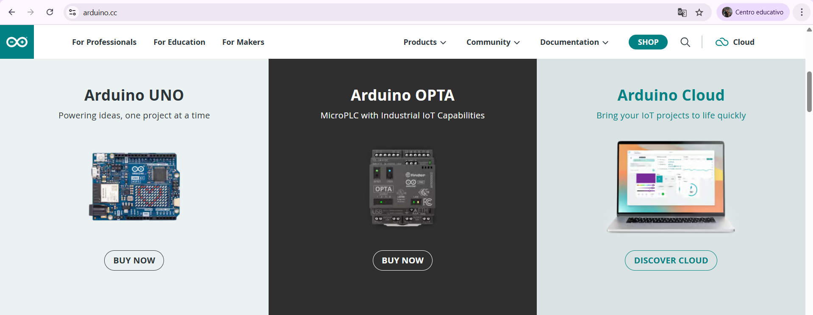
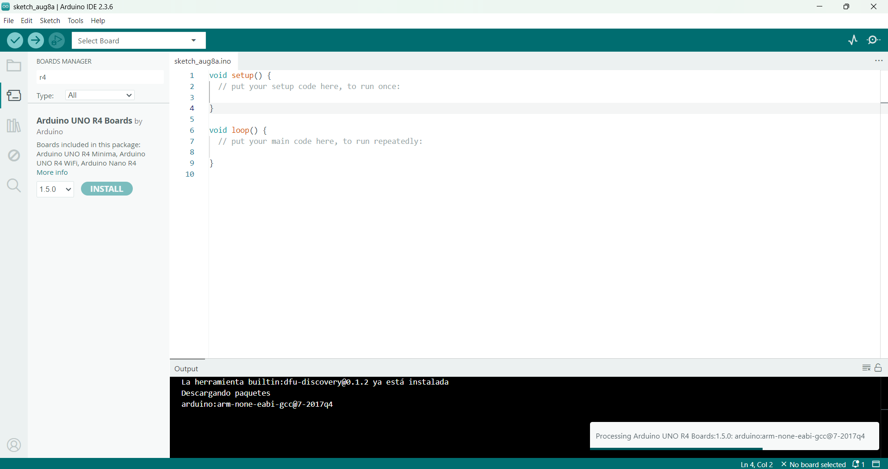

# Sesión-01b

Viernes 08 de agosto, 2025

## Trabajo en clase

### Cosas que hablamos en la mañana

Cuando mandas un correo en bcc (copia oculta), los destinatarios no pueden ver a quién más se lo enviaste, así que no les llegan todos los correos de confirmación porque no pueden ver quién más está en la lista.

También nos explicaron cómo enviar correos a muchas personas usando un alias que agrupa a ese conjunto de contactos.

Hay que tener en cuenta los estados de las máquinas electrónicas. Por ejemplo, hablamos de los botones de los ascensores y cómo a veces, por no saber bien cómo funcionan las cosas, terminamos haciendo acciones cotidianas de forma poco eficiente.

### Preguntas de github

- ¿Cómo se cambia el nombre de una carpeta?

Hay que instalar GitHub en el computador, y desde ahí se puede hacer.

- ¿Cómo se elimina un repositorio?

Cuando estás en el repositorio, puedes ir a Settings, y al final aparece la opción de archivarlo o eliminarlo.

- ¿Cómo me incorporo al repositorio?

Hay que hacer un fork en la parte superior y luego sincronizar.

### Arduino.cc

IDE (Entorno de Desarrollo Integrado) es el programa que se usa para escribir y cargar código en la placa de Arduino.

Con los controles y el menú, se pueden abrir las preferencias de configuración.

Cuando presionas el botón de reset, es como apagar y prender el Arduino, lo reinicia. Incluso si lo desenchufas, el código se queda grabado en la placa, porque tiene memoria.

La palabra "Arduino" se usa para hablar de dos cosas. Primero, el hardware, es decir, la placa física. Y segundo el código, que también se llama Arduino. Es un dialecto de C++ que se escribe en el IDE y se sube a la placa.

Se le puede hacer daño al Arduino con un mal uso del código, pero es difícil. Generalmente, solo se daña físicamente.

Si le das doble clic al botón de reset, entra en un modo especial de reseteo.

No todos los cables USB-C transmiten datos; algunos solo sirven para cargar energía.

¿Qué tengo que hacer para empezar? Tengo que instalar el software de Arduino, asegurarme de que el cable sea compatible (que transmita datos, no solo carga).






### Comentarios y Conceptos Básicos de Arduino

Primero, los comentarios en el código los podemos organizar en papel. A veces, sin comentarios, puede ser más rápido rehacer el código que tratar de entenderlo, no hay que confiar en que vamos a recordar qué hace cada línea.

El setup es importante, ocurre una vez al inicio, es como despetar, solo se hace una vez al día.

El loop es el proceso que continúa durante todo el tiempo, repitiéndose constantemente.

Las patitas del Arduino se llaman pines. Cuando usamos un pin digital, tenemos que decirle para qué sirve con la función pinMode.

Hay varias maneras de programar cosas; lo importante es el camino que tomemos para optimizar el proceso, aunque el resultado sea el mismo.

Podemos usar variables como tiempoPrendido y tiempoApagado.

Las funciones son palabras que llaman a ciertos comportamientos. A diferencia de void setup() y void loop(), el resto de funciones tienen parámetros dentro de los paréntesis, y puede haber muchos parámetros.

Para esto existen reglas de estilo, apuntes consistentes y nombres claros para que el código tenga sentido. La programación tiene reglas estrictas, pero son más o menos legibles; a esto se le llama niveles de abstracción.

En programación, para que algo ocurra, debe haber sido creado antes. Si no existe, el compilador te avisa con un error que dice que no fue declarado.

Para declarar una función, tengo que usar la palabra void y dentro de las llaves { } ponemos el código de la función. Es como darle un nombre a esa función. Por ejemplo, declarar setup es decir que existe esa función. Todo el código está formado por declaraciones de funciones.

No importa el orden en que estén las funciones, pero sí es importante que el compilador sepa que existen, a través de las declaraciones.

Solo es necesario declarar una vez una función o variable, y después puedo usarla cuando quiera.

Paréntesis: () Murciélagos: {} Corchetes: []

C++ variables: int, double, char, string, bool

En el entorno de Arduino, hay cosas que aparecen en celeste y otras en naranjo, lo que ayuda a distinguir funciones, variables y otros elementos del código.

El botón de check ( Verificar) sirve para comprobar si el código funciona correctamente.

La flecha ( Upload ) se utiliza para enviar el código al Arduino a través del cable. Cuando haces upload, el programa primero verifica el código y luego lo sube. Por lo tanto, no es necesario verificar manualmente antes de subirlo.

Si escribes /*todas las líneas que sigan serán consideradas comentarios hasta que pongas*/

Si quieres comentar línea por línea, debes usar // al comienzo de cada una.

Lo ideal es que cada línea de código tenga un comentario explicando lo que hace, especialmente cuando estás empezando.

---

### Referentes

- Alejandra Pizarnik

### Palabras importantes

[Declarar:](https://www.lenovo.com/es/es/glossary/what-is-a-declaration/?orgRef=https%253A%252F%252Fwww.google.com%252F) Una declaración es un enunciado que define o declara una variable, función u objeto en programación. Especifica el nombre, el tipo de datos y el valor inicial (si procede) de la entidad declarada. Las declaraciones son esenciales en programación, ya que permiten al compilador o al intérprete comprender y asignar memoria a las entidades declaradas.

[Variables:](https://www.flexbot.es/variables-y-constantes-en-arduino/) Una variable es la manera que tenemos de guardar valores. Las variables tienen nombre y son de un solo tipo. Estas variables se pueden usar para muchas cosas: comprobaciones, operaciones matemáticas. Una variable puede ser declarada al inicio del programa, antes del setup(), dentro de otras funciones o dentro de un control de flujo.

[Hardware:](https://www.lenovo.com/cl/es/glosario/hardware/?orgRef=https%253A%252F%252Fwww.google.com%252F&srsltid=AfmBOor3Gt7B6Y6xNSJNojEyvhr_MUmAUAT3oOphR7g2wk_2xoFBj4NQ) El hardware se refiere a los componentes físicos de un sistema informático que puedes ver y tocar. Esto incluye dispositivos como la unidad central de procesamiento (CPU), módulos de memoria, discos duros, teclados, mouse, monitores y otros periféricos.

---

## Encargo-03: Programar y equivocarse 5 veces

Un poco desde el futuro, vuelvo a realizar estos ejemplos para entender nuevamente la programación, ya que me he encontrado un poco perdida. Decidí registrarlo aquí porque no me había gustado cómo me había quedado la organización de este encargo. Hoy es 8 de octubre, pero supongo que nunca es tarde para aprender, jajaja. Al menos eso quiero pensar ._.

Me fui guiando con una lista de mini tutoriales de Arduino y con la cuenta de GitHub de [johannpereze](https://github.com/johannpereze/cursoArduinoJohannPerezE)

> Video de referencia ["Cómo PROGRAMAR arduino UNO desde CERO"](https://youtu.be/EEKMPT_YcTI)

En este me costó mucho encontrar el error; lo releí varias veces hasta que me di cuenta de que le faltaba una R.

```ccp
void setup() {
pinM0de(13,OUTPUT);
}

void loop() {

digitalWite(13,HIGH);
delay(100);
digitalWrite(13,LOW);
delay(100);
}

```

Luego de corregir este ejemplo, pensé que el código iba a funcionar bien, pero no compilaba correctamente. Intenté sacar el LED que estaba en el pin 13, pero tampoco resultó.

Después volví a conectar el LED y revisé el código parte por parte, hasta que me di cuenta de que en pinMode había un cero en lugar de una letra O. La verdad, eso sí que me costó descubrir.

```ccp
void setup() {
pinM0de(13,OUTPUT);
}

void loop() {

digitalWrite(13,HIGH);
delay(100);
digitalWrite(13,LOW);
delay(100);
}
```

Para la próxima le voy a preguntar a ChatGPT, porque perdí mucho tiempo buscando un error que no tenía nada que ver con la programación. Aunque, bueno, me imagino que en general así son los errores de programación.

```ccp
void setup() {
pinMode(13,OUTPUT);
}

void loop() {

digitalWrite(13,HIGH);
delay(100);
digitalWrite(13,LOW);
delay(100);
}
```

Aquí estuve probando cómo utilizar la protoboard con el Arduino, y me faltó un ;.

> Video de referencia ["Cómo usar un PROTOBOARD Arduino desde CERO"](https://youtu.be/ycXI2E7iArY)

```ccp
void setup() {

pinMode(8,OUTPUT)
}

void loop() {
digitalWrite(8,HIGH);
delay(50);
digitalWrite(8,LOW);
delay(50);

}
```

Aquí escribí bien el código usando el ejemplo de la clase.

> Video de referencia ["VARIABLES Enteras en Arduino con Código MORSE"](https://youtu.be/r8sk5JzUWLQ)

Sin embargo, se me olvidó cambiar el pin al 7, así que prácticamente no estaba conectado a la protoboard.

```ccp
int dot = 100;
int dash = 300;
int ledPin = 7;
int finalDelay = 1500;

void setup() {
  // put your setup code here, to run once:
pinMode(ledPin,OUTPUT);
}

void loop() {
  // put your main code here, to run repeatedly:
digitalWrite(ledPin,HIGH);
delay(dot);
digitalWrite(ledPin,LOW);
delay(dot);

digitalWrite(ledPin,HIGH);
delay(dash);
digitalWrite(ledPin,LOW);
delay(dash);


digitalWrite(ledPin,HIGH);
delay(dot);
digitalWrite(ledPin,LOW);
delay(dot);
```
