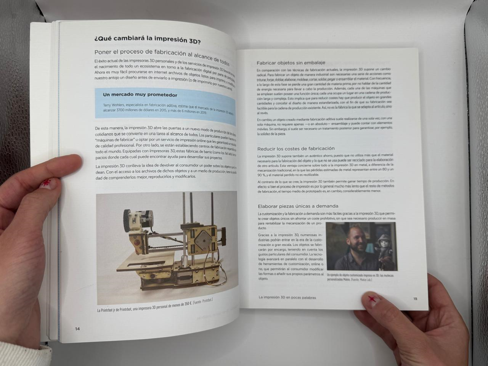

# sesion-07a / Clase 12 / 23.09.2025

Proyecto 02:  17 de Octubre

## Inicio de clase

## Yuk Hui

Yuk Hui es un filósofo hongkonés, profesor de filosofía y catedrático en la Universidad Erasmo de Róterdam. Es conocido por sus escritos sobre filosofía y tecnología. Hui ha sido descrito como uno de los filósofos de la tecnología contemporáneos más interesantes.

- Cosmotécnica.
- Tecnodiversidad.
- Libro: The Question Concerning Technology in China.

[Susana Chau](https://cl.linkedin.com/in/susana-chau)

[Yuk Hui](https://cajanegraeditora.com.ar/autores/?autor=hui-yuk)

[LinquenLab](https://liquenlab.cl/)

## Motores

- [Motor DC](https://afel.cl/collections/alta-velocidad): Muy rápido pero no sabe donde está. (drones, ventiladores, vibradores, etc).
- [Motor paso a paso](https://afel.cl/collections/paso-a-paso) lento, preciso y tampoco sabe donde está. Funciona con grados. (impresoras 3D).
- [Servomotor](https://afel.cl/collections/servomotores) Existen con diferentes grados (90°, 180°, 270°, 360°).

## Leds

- [Diodo LED](https://afel.cl/products/diodo-led-5mm-ultrabrillante-amarillo): Alta visibilidad con un bajo consumo de energía.
- [Tira LED](https://www.ledstudio.cl/cinta-led-studio-14-4wm-luz-calida-12v-ip20-5-metros/p?idsku=2613&gad_source=1&gad_campaignid=22832701091&gbraid=0AAAAAC3lBbVk3EcqAoN-CH64R4i0s6UVU&gclid=Cj0KCQjwrojHBhDdARIsAJdEJ_fHvfFZk9yQCcxefMnpzpdf753iTM_aG5BkuahinVsrTLfUK7_0E4waAkHYEALw_wcB): Placa de circuito flexible con diodos emisores de luz (LED).
- [Anillo LED RGB](https://afel.cl/products/anillo-led-rgb-neopixel-12-leds-ws2812): Compuesto por 12 LEDs RGB direccionables, estos diodos LED tipo 5050 incluyen un controlador WS2812 integrado.
- [Diodo LED RGB](https://afel.cl/products/diodo-led-rgb-5mm): Este LED RGB de 5 mm integra tres diodos emisores de luz (Rojo, Verde y Azul) en un solo encapsulado, permitiendo generar una amplia gama de colores mediante la combinación de intensidades.

¿Qué es un controlador WS2812?

Los WS2812 son LED que disponen de lógica integrada, bajo consumo, alto brillo e incorpora en un único encapsulado los 3 colores RGB. La diferencia del WS2812 con leds convencionales es que se ha añadido un integrado dentro de cada LED, que permite acceder a cada pixel de forma individual. Por este motivo este tipo de LED se denominan “direccionables”.

## Proyecto 02

Leonas.ino

### Integrantes

- Yamna Carrión
- Sofía Cartes
- Millaray Millar
- Vania Paredes
- Valentina Ruz

### Idea 01

En una primera instancia, el proyecto constaba de un personaje el cual iba a reaccionar mediante que el usuario presionaba ciertos botones. Esta reacción se basaba en saludar en un idioma en específico con su gestualidad correspondiente.

Entrada: Joystick, según la dirección que se escoge, es el tipo de idioma que habla.

Idiomas:

- Español (arriba).
- Portugués (abajo).
- Chino (izquierda).
- Italiano (derecha).
- Al presionar el joystick, es reset

Tipo de audio:

- Hola, qué bueno que estés aquí.
- ¿Cómo has estado?

Lenguaje diferenciado del dialecto.
Interacción con joystick, reproducción de audio.

Salida: Al interactuar con el joystick, se van a reproducir los audios predeterminados con el lenguaje seleccionado.

--------

### Idea 02

El proyecto constaba de un personaje el cual iba a reaccionar mediante detecta un estímulo que esté cercano (persona) el cual lo va a llamar y detectando la distancia que se encuentra cambiara el audio de reproducción, la idea es que primero llame su atención y después lo invite a acercarse para contarle un secreto.

También la idea es que el personaje empiece a tiritar mediante la persona se acerca de esa manera, genera más interés en los que se está realizando.

Entrada: El personaje llama la atención de la persona y le pide que se acerque al mismo tiempo, empieza a tiritar.

- Motor DC
- Sensor ultrasónico
- Módulo reproductor

Salida: Cuando una persona está cerca, el personaje le susurra el secreto.

Factores a considerar:

- ¿Qué secretos va a contar?
- ¿Cuántos rangos de proximidad existirán?
- ¿Cómo se verá físicamente este personaje?
- ¿Cómo regular el volumen?

## Encargo

- Leer las bitacoras de colegas, encontrar similitudes, diferencias, preguntas y aciertos de sus máquinas saludadoras propuestas.

### Grupo 02 

- Catalina Catalán
- Valentina Chávez
- Camila Delgado
- Nicolás Miranda
- Miguel Vera

La propuesta del grupo consiste en una máquina dispensadora de chicles de distintos colores que, al reconocer el color del chicle, emite un mensaje mediante un altavoz.

Similitudes:
- Ambas son máquinas que saludan.
- Ambas usan un altavoz como medio de salida.
- El saludo cambia en función de una condición (color o distancia).

Diferencias:
- Una se activa por proximidad, la otra por el color del chicle.
- En una, el saludo varía en tono y contenido; en la otra, solo cambia el mensaje.
- Una interactúa directamente con la persona; la otra, con el objeto y el mensaje.

¿Qué tipo de mensajes emite la máquina?
¿Cuántos colores diferentes puede detectar actualmente la máquina?

### Grupo 04

- brauliofigueroa2001
- Bernardita-Jesus
- jotamorales-romulus
- Camila-Parada
- FranUDP

La propuesta consiste en una máquina con ojos que detectan la profundidad y siguen a la persona. Al acercarse, una oreja emite un sonido aleatorio como si hablara.

Similitudes:

- Ambas máquinas se activan por la cercanía y la interacción con la distancia.
- Ambas están inspiradas en la idea de contar un secreto.
- Ambas utilizan la voz o el sonido como medio de comunicación.
  
Diferencias:

- La propuesta propia tiene tres niveles de interacción según la distancia; la otra usa una oreja parlante como elemento irónico.
- La máquina propia es efusiva y grita para atraer; la otra es más enigmática y te sigue con la mirada.
- Una varía el tono de voz según la distancia; la otra utiliza ojos para seguir al usuario y una oreja que emite sonidos.

¿Qué tipo de sonidos emite la oreja? ¿Son palabras, murmullos, efectos sonoros?

- Buscar 2 referentes asociados a tu proyecto de cada una de estas 4 categorías: 1. lenguaje natural (personas), 2. código, 3. materialidad, 4. documentación. escribir un párrafo por cada uno de los referentes encontrados, citando las fuentes, y explicando por qué lo elegiste, qué te aporta, qué te inspira, o incluso si lo incluyes como antiejemplo.
  
### Referentes

- Libro: La impresión 3D - Mathilde Berchon

